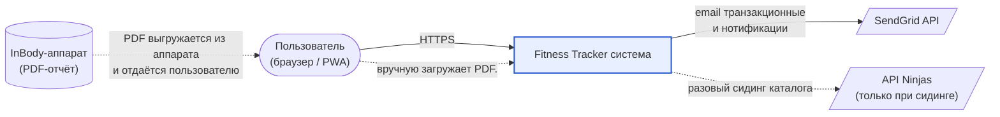
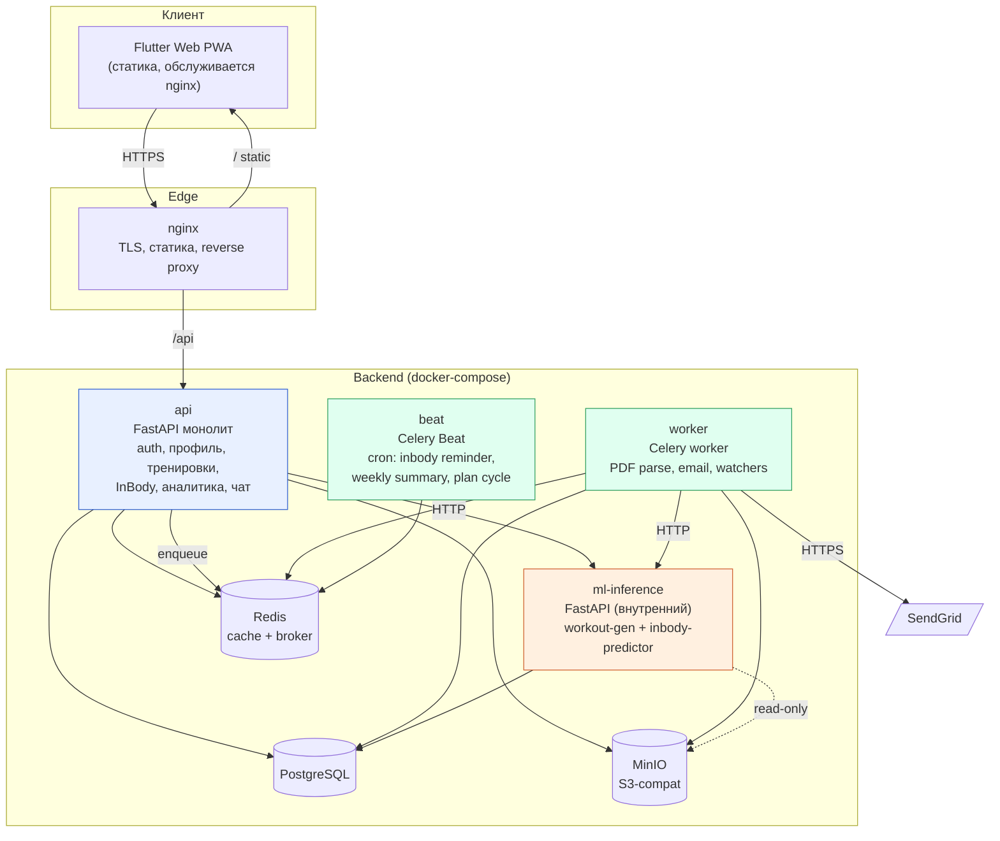

# Fitness Tracker — Architecture Overview

Этот документ собирает high-level картину системы. Подробности — в соседних файлах.

| Документ | О чём |
|----------|-------|
| [01-system-components.md](01-system-components.md) | Контейнеры/сервисы и их ответственность, межсервисные интерфейсы |
| [02-data-model.md](02-data-model.md) | ER-диаграмма, таблицы PostgreSQL, индексы, миграции |
| [03-ml-architecture.md](03-ml-architecture.md) | ML-блоки Егора и Маши: training pipeline, serving, версии моделей |
| [04-flows.md](04-flows.md) | Sequence-диаграммы ключевых сценариев |
| [05-deployment.md](05-deployment.md) | docker-compose layout, env, секреты |
| [06-api-design.md](06-api-design.md) | API-конвенции, ошибки, версионирование, идемпотентность |
| [07-security.md](07-security.md) | Auth flows, encryption-at-rest, GDPR |
| [08-frontend-architecture.md](08-frontend-architecture.md) | Flutter PWA: слои, Riverpod, routing, Drift, тестирование, theming |

---

## Цели архитектуры

1. **Минимизировать рутину разработки** — двое студентов пишут на диплом, нужно укладываться в сроки.
2. **Чётко разделить зоны ответственности** между Егором (workout-gen ML), Машей (inbody-predictor ML), общим продуктом.
3. **Хорошо защищаться** — архитектура должна быть аккуратной, описанной, демонстрируемой; не «теоретическая», а реально работающая в docker-compose.
4. **Не переинженериться** — без k8s, без managed-сервисов, без service mesh. Один хост, docker-compose.
5. **ML-часть изолирована** — генерация плана и прогноз вынесены в отдельный сервис (`ml-inference`), чтобы их падение/долгий инференс не валили основной API; это же даёт явную поверхность для презентации магистерских.

---

## Ключевые архитектурные решения

| Решение | Что выбрано | Почему |
|---------|-------------|--------|
| Архитектурный стиль | Modular monolith API + один outbound ML-сервис + worker | Простота dev, изоляция ML, понятная демонстрация |
| Backend язык/фреймворк | Python 3.12, FastAPI | Зафиксировано в overview спеков |
| База данных | PostgreSQL 16 | Реляционная модель отлично подходит, поддержка JSONB для гибких полей |
| Кэш / очереди | Redis 7 | Двойное использование: кэш + брокер Celery |
| Фоновые задачи | Celery (задачи) + Celery Beat (cron) | Зрелый стек, ретраи, schedules |
| Object storage | MinIO (S3-совместимое) | Локально, легко переехать на AWS S3 / Yandex Object Storage |
| Reverse proxy | nginx | TLS termination + статика PWA + проксирование на FastAPI |
| Frontend | Flutter Web (PWA) + Riverpod + Dio | Зафиксировано в overview спеков |
| ML | PyTorch / Scikit-Learn | По предпочтению авторов; обе модели небольшие |
| Сериализация моделей | Версионированные артефакты в `models/` (joblib + state_dict) | Привязка к `model_version` строкой |
| Email | SendGrid (через worker) | Явно указано в ТЗ |
| Локальная разработка | docker-compose + uv для api/worker | Один `docker compose up` поднимает всё |
| Мобильность | PWA + responsive UI | Вместо нативных приложений |

---

## C4: System Context



Внешние интеграции:
- **SendGrid** — отправка email (verify, reset, reminders, weekly summary).
- **API Ninjas (Exercises)** — только во время ETL для сидинга каталога упражнений (см. spec 012). Не вызывается из runtime API.
- **InBody** — нет прямой интеграции; пользователь руками загружает PDF.
- **OpenAI / другой LLM (опционально)** — для свободных вопросов в чате-ассистенте (см. spec 009). Включается feature-flag.

---

## C4: Containers



Подробное описание каждого контейнера → [01-system-components.md](01-system-components.md).

---

## Принципы

### Чёткая граница API ↔ ML
Все вызовы ML — через **HTTP-интерфейс ml-inference** (внутренняя сеть). Это:
- Позволяет независимо деплоить и тестировать модели.
- Делает explicit, что считается «ML-инференсом» (важно для магистерских).
- Даёт fallback: если ml-inference недоступен, `api` отдаёт rule-based ответ + помечает `fallback: true` (см. specs 006, 008).

### Идемпотентность пользовательских операций
Все "тяжёлые" операции (генерация плана, парсинг PDF, экспорт PDF) — через async pattern: `POST` создаёт job, `GET` возвращает статус. Подробности → [06-api-design.md](06-api-design.md).

### Domain modules внутри монолита
Хотя `api` — это один процесс, код разбит по доменам:
```
app/
  auth/        # spec 001
  profile/     # spec 002
  inbody/      # spec 003, 013
  catalog/     # spec 004
  workouts/    # spec 005
  plans/       # spec 006 (вызывает ml-inference)
  nutrition/   # spec 007
  forecast/    # spec 008 (вызывает ml-inference)
  adaptation/  # spec 009
  chat/        # spec 009
  analytics/   # spec 010
  notifications/ # spec 011
```
Любой домен может зависеть только от своих сущностей и общего ядра (`shared/`). Cross-domain — только через сервисные слои.

### Schema-first
- БД — миграции через **Alembic**. Каждая фича — одна миграция.
- API — pydantic v2 модели → OpenAPI генерируется автоматически. Frontend генерирует Dio-клиент из OpenAPI (`http_mock_adapter` в тестах).

### Безопасность по умолчанию
- HTTPS на всём периметре (nginx).
- JWT access (15 мин) + refresh (30 дней). Подробности → [07-security.md](07-security.md).
- Шифрование чувствительных полей в БД на уровне приложения (InBody-показатели, email — отдельно).

---

## Что НЕ делаем (явно)

- Никаких микросервисов сверх `api / ml-inference / worker / beat`.
- Никаких managed-сервисов (managed Postgres/Redis/email-platform).
- Никакой service mesh, k8s, observability-стека (Prometheus/Grafana — приветствуется как nice-to-have, но не блокирует диплом).
- Никаких mobile native apps — только PWA.
- Никакого WebSocket в MVP (чат — обычный request/response).
- Никакого online-обучения моделей в проде — только периодический retrain командой вручную.

---

## Trade-offs и риски

| Риск | Митигация |
|------|-----------|
| ML-модель Маши требует длинной истории, а у новых пользователей её нет | Cross-user baseline + явный `confidence: low` в ответе (spec 008) |
| Объединённый датасет может содержать лицензионные несовместимости | Lic-аудит в spec 012, до публичного запуска |
| Celery worker может уйти в OOM при парсинге больших PDF | Лимит 10 MB (spec 013) + memory limit в docker-compose |
| Размер отчётов может расти линейно с историей пользователя | PDF-экспорт ограничен 50 страницами (spec 010) |
| Один хост = single point of failure | Допустимо для диплома; в overview зафиксировано как scope-limit |
| LLM в чате — внешняя зависимость с непредсказуемой ценой | Feature flag, можно отключить; rule-based path работает без LLM |

---

## Следующие шаги по архитектуре

1. Утвердить схему БД с обоими студентами → [02-data-model.md](02-data-model.md).
2. Зафиксировать ML-контракт `api ↔ ml-inference` до начала имплементации моделей → [03-ml-architecture.md](03-ml-architecture.md).
3. Поднять docker-compose-скелет (пустые сервисы, миграции, healthchecks) — это и есть «Iteration 0».
