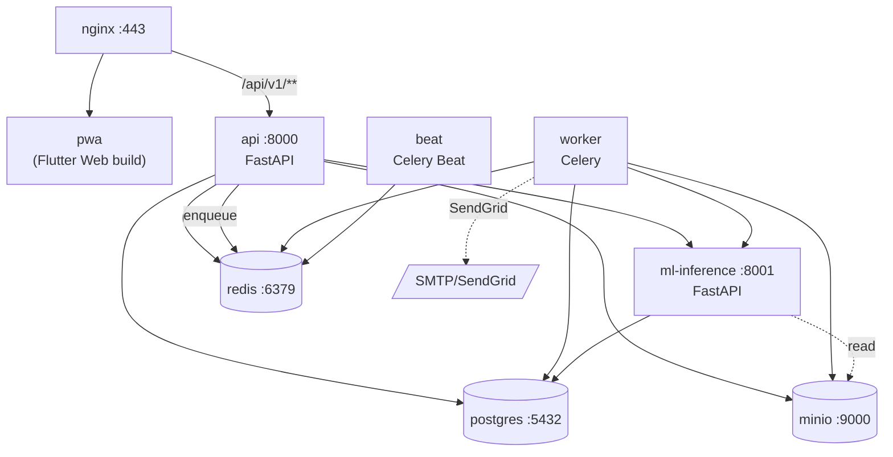
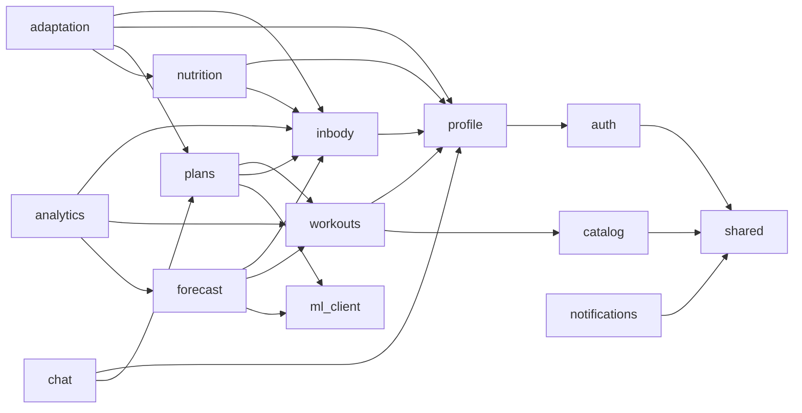

# System Components

Подробное описание каждого контейнера: ответственность, технологии, входы/выходы, ключевые внутренние модули.

---

## Карта компонентов



---

## 1. `pwa` — Frontend

**Что это:** статически собранное Flutter Web приложение, обслуживается nginx как обычная статика. Логически отдельный «контейнер», физически — это volume со сборкой, который nginx раздаёт.

**Стек:**
- Flutter 3.x + Dart
- Riverpod — state management
- Dio + http_mock_adapter — HTTP-клиент и моки для тестов
- shadcn (Flutter port) — UI-компоненты
- go_router — навигация
- flutter_secure_storage — хранение refresh-токена
- fl_chart — графики аналитики (см. spec 010)

**Структура слоёв (Flutter):**
```
lib/
  app/                 # router, theme, di
  features/
    auth/
    profile/
    inbody/
    catalog/
    workouts/
    plan/
    nutrition/
    chat/
    forecast/
    analytics/
    notifications/
  data/
    api/               # auto-generated dio client из OpenAPI
    repositories/
  domain/              # модели, use cases
  ui/                  # переиспользуемые виджеты
```

**Сборка:** `flutter build web --release` → каталог `web/build/` монтируется в nginx-контейнер.

**Auth:** access-токен в memory, refresh — в `flutter_secure_storage` (web: IndexedDB через secure-storage shim).

**Offline:** базовый PWA service worker; критичный кэш — каталог упражнений и текущая активная тренировка (spec 005, NFR-02).

---

## 2. `nginx` — Edge

**Что это:** TLS-терминатор и reverse proxy.

**Ответственность:**
- TLS termination (self-signed для локалки, Let's Encrypt для VPS).
- Раздача статики PWA (`/`).
- Проксирование `/api/v1/**` → `api:8000`.
- gzip/brotli, кэш заголовков для статики.
- Rate-limiting для `/api/v1/auth/**` (защита от перебора, см. spec 001 REQ-06).

**Что НЕ делает:** аутентификацию, бизнес-логику, ML-вызовы.

**Конфиг:** один `nginx.conf` с двумя серверами (HTTP→HTTPS redirect и HTTPS server). Подробности → [05-deployment.md](05-deployment.md).

---

## 3. `api` — Основной API (FastAPI монолит)

**Что это:** главный application-сервер. Принимает HTTP-запросы пользователя.

**Стек:**
- Python 3.12, FastAPI, Pydantic v2
- SQLAlchemy 2.x async + asyncpg
- Alembic — миграции
- python-jose (JWT) + passlib (password hashing с argon2)
- aioboto3 — клиент к MinIO
- redis-py async — кэш + продюсер для Celery
- celery — только продюсер (kombu)

**Структура (modular monolith):**

```
app/
  main.py                      # FastAPI app instance, middleware, routers
  config.py                    # Pydantic settings
  shared/
    database.py                # Async session, engine
    redis.py                   # Async redis client
    storage.py                 # MinIO client
    security.py                # JWT, hash
    errors.py                  # ApplicationError + HTTP mapping
    pagination.py
  domains/
    auth/
      router.py                # /api/v1/auth/**
      service.py
      models.py                # SQLAlchemy: User, AuthToken
      schemas.py               # Pydantic
    profile/                   # spec 002
    inbody/                    # spec 003 (вкл. PDF upload endpoint)
    catalog/                   # spec 004
    workouts/                  # spec 005
    plans/                     # spec 006 (вызывает ml-inference)
    nutrition/                 # spec 007 (rule-based)
    forecast/                  # spec 008 (вызывает ml-inference)
    adaptation/                # spec 009 (watchers + триггеры)
    chat/                      # spec 009
    analytics/                 # spec 010
    notifications/             # spec 011 (только preferences + inbox API)
  ml_client/
    workout_gen.py             # клиент к ml-inference: /workout-gen/generate
    inbody_pred.py             # /inbody-pred/forecast
    fallback.py                # rule-based fallback
  jobs/
    enqueue.py                 # отправка в Celery
```

**Зависимости между доменами:**



**Правило:** домен может импортировать сущности других доменов только через их `service.py` (никаких прямых SQL join'ов в чужие таблицы).

**Транзакции:** одна async DB-сессия на запрос (FastAPI dependency `get_session`). Сервисы получают session как аргумент.

**Что api НЕ делает:**
- Не парсит PDF (это worker).
- Не отправляет email (это worker).
- Не запускает ML-обучение.
- Не выполняет cron (это beat).

---

## 4. `ml-inference` — ML serving

**Что это:** отдельный FastAPI-сервис (внутренняя сеть docker-compose), который держит загруженные модели в памяти и отвечает на инференс-запросы.

**Стек:**
- Python 3.12, FastAPI
- PyTorch / Scikit-Learn (зависит от выбора моделей)
- joblib для классики, `torch.load` + state_dict для нейросеток
- pandas/numpy

**Эндпоинты (внутренние):**

| Метод | Путь | Что делает |
|-------|------|------------|
| `POST` | `/internal/v1/workout-gen/generate` | Принимает фичи пользователя → возвращает план на 4 недели |
| `POST` | `/internal/v1/inbody-pred/forecast` | Фичи + history → прогноз weight/bf/mm на горизонты 1/2/4 недели |
| `POST` | `/internal/v1/inbody-pred/what-if` | То же + override-параметры |
| `GET`  | `/internal/v1/health` | Liveness |
| `GET`  | `/internal/v1/models` | Список загруженных моделей и версии |

Все эндпоинты префикса `/internal` доступны только из внутренней docker-сети (nginx их не проксирует).

**Загрузка моделей:** при старте читает `models/` (volume) и загружает текущие версии в память. Активная версия фиксируется в env (`WORKOUT_GEN_VERSION=0.3.1`, `INBODY_PRED_VERSION=0.4.2`).

**Hot reload моделей:** не делается. Чтобы поменять версию — рестарт контейнера (приемлемо для диплома).

**Граница ответственности:**
- ml-inference **не пишет** в Postgres. Чтение — допустимо, например, для проброса контекста; но в текущей версии модели stateless: всё, что им нужно, передаётся в request body.
- ml-inference **читает** MinIO только для загрузки артефактов моделей при старте (если модели хранятся в MinIO, а не в локальном volume — см. [03-ml-architecture.md](03-ml-architecture.md)).

**Подробности обучения и пайплайна** → [03-ml-architecture.md](03-ml-architecture.md).

---

## 5. `worker` — Celery worker

**Что это:** фоновый воркер для тяжёлых, отложенных, ретриабельных задач.

**Стек:**
- Python 3.12, Celery 5
- Redis как broker и result backend
- pdfplumber / pymupdf — парсинг PDF (spec 013)
- weasyprint / reportlab — генерация PDF-отчётов (spec 010)
- httpx — обращение к SendGrid и ml-inference

**Очереди:**

| Очередь | Назначение |
|---------|------------|
| `default` | Универсальные задачи |
| `pdf` | Парсинг загруженных InBody-PDF и генерация отчётных PDF |
| `email` | Отправка через SendGrid |
| `ml` | Долгие ML-задачи (ретрейн вызывается вручную, не из API) |
| `watchers` | Триггеры адаптации плана (spec 009) |

**Задачи (примеры):**

| Задача | Триггер | Очередь |
|--------|---------|---------|
| `parse_inbody_pdf(job_id)` | API endpoint upload PDF | pdf |
| `generate_analytics_pdf(job_id)` | API endpoint export | pdf |
| `send_email(message_id)` | enqueue из api | email |
| `check_inbody_reminders()` | Beat (раз в сутки) | watchers |
| `weekly_summary()` | Beat (понедельник 09:00) | watchers |
| `process_plan_rebuild_event(event_id)` | enqueue из api при изменении профиля/InBody | watchers |
| `cleanup_pdf_temp()` | Beat (раз в час) — удаление temp_pdf_path с TTL >1ч | default |

**Идемпотентность:** все задачи принимают только id записи в БД, тело берут из БД. Это даёт безопасные ретраи. `context_key` в `NotificationOutbox` (spec 011) защищает от дубликатов.

**Ретраи:** дефолт `autoretry_for=(NetworkError, ServiceUnavailable)`, max_retries=3, экспоненциальный бэкофф.

---

## 6. `beat` — Celery Beat

**Что это:** планировщик cron-задач, отдельный процесс (Celery best practice — не запускать beat в worker).

**Расписание (хранится в коде, через `CELERY_BEAT_SCHEDULE`):**

| Cron | Задача |
|------|--------|
| `*/5 * * * *` | health-self-check (опц.) |
| `0 * * * *` | `cleanup_pdf_temp` |
| `0 6 * * *` | `check_inbody_reminders` |
| `0 9 * * MON` | `weekly_summary` |
| `0 3 * * *` | `check_plan_cycles` (4-недельные циклы → автоперегенерация) |

---

## 7. `postgres` — БД

**Что это:** PostgreSQL 16 (alpine) в одном контейнере; persistent volume для `pgdata`.

**Расширения:**
- `uuid-ossp` — генерация UUID v4
- `pgcrypto` — приложение шифрует чувствительные поля; helpers для at-rest encryption

**Подключения:**
- `api` и `worker` — async через asyncpg
- `ml-inference` — sync через psycopg2 (если ему вообще нужно)
- Alembic — sync через psycopg2

**Бэкапы:** для диплома — `pg_dump` руками или скрипт. Для VPS-варианта — daily cron.

**Полная схема** → [02-data-model.md](02-data-model.md).

---

## 8. `redis` — Cache + broker

**Что это:** Redis 7 (alpine), persistent volume для AOF.

**Использование:**

| База | Назначение |
|------|------------|
| `0` | Celery broker |
| `1` | Celery result backend |
| `2` | Application cache (профили, каталог упражнений, прогнозы) |
| `3` | Rate limiting (spec 001 REQ-06) |

**Cache TTL:**
- Каталог упражнений: 24 часа.
- Прогноз InBody: 24 часа на пользователя (spec 008 NFR-02).
- Профиль пользователя: 5 минут.
- Аналитика серий: 5 минут.

---

## 9. `minio` — Object storage

**Что это:** S3-совместимое хранилище.

**Buckets:**

| Bucket | Что лежит | Visibility |
|--------|-----------|------------|
| `inbody-pdf-temp` | Временные uploads до подтверждения | private, lifecycle TTL 1ч |
| `inbody-pdf` | Подтверждённые оригиналы PDF InBody | private, signed URLs |
| `profile-photos` | Фото профиля | private, signed URLs |
| `analytics-reports` | Сгенерированные PDF-отчёты | private, signed URLs (TTL 1ч) |
| `ml-models` (опц.) | Артефакты моделей (если не локальный volume) | internal-only |

**Доступ:** все signed URL — TTL ≤1 час (spec 010 NFR-03).

**Дизайн ключей:** `{user_id}/{entity_type}/{entity_id}.{ext}`. Например: `9f8e.../inbody/2026-04-28T10-00.pdf`.

---

## Межсервисные интерфейсы

### `api` ↔ `ml-inference`

HTTP в внутренней docker-сети, JSON. Подробные контракты → [03-ml-architecture.md](03-ml-architecture.md).

Авторизация: shared secret (`ML_INTERNAL_TOKEN` в env, передаётся в заголовке `X-Internal-Token`).

### `api` ↔ `worker`

Только через Redis (Celery broker). API кладёт задачу — worker её берёт. Никаких прямых HTTP вызовов.

### `worker` ↔ `ml-inference`

Тот же HTTP-интерфейс. Worker нужен ml-inference, например, при `process_plan_rebuild_event` — там может потребоваться перегенерация плана.

### `api`/`worker` ↔ `postgres`

SQLAlchemy async session. Транзакция scope = один HTTP-запрос или одна задача Celery.

### `api`/`worker` ↔ `minio`

aioboto3, presigned URLs.

### `worker` ↔ SendGrid

httpx Async, retry с экспоненциальным бэкоффом. Все письма помечаются `X-Mailer: fitness-tracker/<version>`.

---

## Логи и метрики (минимум для диплома)

- **Логи:** structlog → JSON в stdout. Просмотр через `docker compose logs -f api`.
- **Trace ID:** middleware генерирует `X-Request-ID`, прокидывается через все вызовы (api → ml → worker через Celery `task_id` extra).
- **Метрики:** опционально — Prometheus exporter в FastAPI, Grafana docker-compose. Не блокирует диплом, но nice-to-have.
- **Health endpoints:**
  - `GET /api/v1/health` (api)
  - `GET /internal/v1/health` (ml-inference)
  - Celery: `celery -A app inspect ping`

---

## Что в каком репозитории

Однорепозиторный подход (monorepo):

```
fitness-tracker/
  app/                        # api + worker + beat (общий код)
  ml/
    inference/                # ml-inference сервис
    training/                 # обучение моделей (CLI/notebooks)
    data/                     # см. spec 012
    models/                   # артефакты (gitignored, версионируются через DVC опц.)
  pwa/                        # Flutter Web
  deploy/
    docker-compose.yml
    nginx/
    postgres/
    minio/
  specs/                      # спецификации (этот проект)
  docs/
    architecture/             # эта документация
```

Это упрощает CI/CD и обеспечивает атомарные изменения схемы БД + API + клиента.
