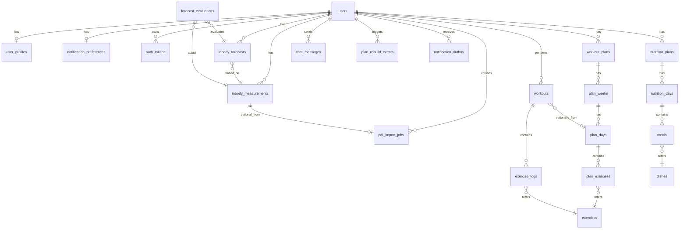

# Data Model — PostgreSQL Schema

Полная схема БД. Имена таблиц — `snake_case`, plural; колонки — `snake_case` singular.

Все таблицы имеют `id UUID PRIMARY KEY DEFAULT uuid_generate_v4()` (если не указано иное), `created_at TIMESTAMPTZ NOT NULL DEFAULT now()`, и где применимо `updated_at TIMESTAMPTZ NOT NULL DEFAULT now()` с триггером.

---

## ER-обзор

---

## Группа 1: Auth & Profile

### `users` (spec 001)

| Column | Type | Constraints | Notes |
|--------|------|-------------|-------|
| id | UUID | PK | |
| email | citext | UNIQUE, NOT NULL | расширение `citext` для case-insensitive |
| password_hash | TEXT | NOT NULL | argon2id |
| email_status | TEXT | NOT NULL CHECK IN ('unconfirmed','active'), DEFAULT 'unconfirmed' | |
| created_at | TIMESTAMPTZ | NOT NULL | |
| deleted_at | TIMESTAMPTZ | NULL | soft delete для GDPR-flow; полная очистка ≤30 дней (cron) |

Индексы: `(email)` уникальный (citext), `(email_status, created_at)` для аналитики.

### `auth_tokens`

| Column | Type | Constraints |
|--------|------|-------------|
| id | UUID | PK |
| user_id | UUID | FK → users(id) ON DELETE CASCADE |
| type | TEXT | CHECK IN ('email_verify','password_reset','session','refresh') |
| token_hash | TEXT | UNIQUE NOT NULL |
| expires_at | TIMESTAMPTZ | NOT NULL |
| used_at | TIMESTAMPTZ | NULL |
| created_at | TIMESTAMPTZ | NOT NULL |

Индексы: `(user_id, type)`, `(expires_at)` для cleanup.

### `user_profiles` (spec 002)

| Column | Type | Constraints |
|--------|------|-------------|
| user_id | UUID | PK + FK → users(id) ON DELETE CASCADE (1:1) |
| name | TEXT | NOT NULL CHECK length 1..50 |
| sex | TEXT | NOT NULL CHECK IN ('male','female') |
| birth_date | DATE | NOT NULL |
| height_cm | NUMERIC(5,2) | NOT NULL CHECK 100..250 |
| baseline_weight_kg | NUMERIC(5,2) | NOT NULL CHECK 30..300 |
| goal | TEXT | NOT NULL CHECK IN ('weight_loss','muscle_gain','maintenance') |
| training_level | TEXT | NOT NULL CHECK IN ('beginner','intermediate','advanced') |
| training_frequency | SMALLINT | NOT NULL CHECK 2..6 |
| equipment_available | TEXT[] | NOT NULL DEFAULT '{}' |
| allergies | TEXT[] | NOT NULL DEFAULT '{}' |
| photo_url | TEXT | NULL (S3 key) |
| bmr_kcal | NUMERIC(7,2) | NULL (computed by trigger or app) |
| target_weight_kg | NUMERIC(5,2) | NULL |
| target_muscle_kg | NUMERIC(5,2) | NULL |
| goal_started_at | DATE | NULL |
| onboarding_completed_at | TIMESTAMPTZ | NULL |
| plan_rebuild_required | BOOLEAN | NOT NULL DEFAULT FALSE |
| updated_at | TIMESTAMPTZ | NOT NULL |

### `notification_preferences` (spec 011)

| Column | Type | Constraints |
|--------|------|-------------|
| user_id | UUID | PK + FK → users(id) ON DELETE CASCADE |
| inbody_reminder | BOOLEAN | NOT NULL DEFAULT TRUE |
| plan_update | BOOLEAN | NOT NULL DEFAULT TRUE |
| weekly_summary | BOOLEAN | NOT NULL DEFAULT TRUE |
| email_enabled | BOOLEAN | NOT NULL DEFAULT TRUE |
| updated_at | TIMESTAMPTZ | NOT NULL |

---

## Группа 2: InBody (spec 003, 013)

### `inbody_measurements`

| Column | Type | Constraints |
|--------|------|-------------|
| id | UUID | PK |
| user_id | UUID | FK → users(id) ON DELETE CASCADE |
| measured_at | TIMESTAMPTZ | NOT NULL CHECK ≤ now() |
| weight_kg | NUMERIC(5,2) | NOT NULL CHECK 30..300 |
| height_cm | NUMERIC(5,2) | NOT NULL CHECK 100..250 |
| sex | TEXT | NOT NULL CHECK IN ('male','female') |
| muscle_mass_kg | NUMERIC(5,2) | NULL CHECK 5..120 |
| body_fat_percent | NUMERIC(4,2) | NOT NULL CHECK 1..70 |
| body_water_percent | NUMERIC(4,2) | NULL CHECK 30..80 |
| protein_kg | NUMERIC(5,2) | NULL CHECK 1..30 |
| minerals_kg | NUMERIC(5,2) | NULL CHECK 0.5..10 |
| visceral_fat_level | SMALLINT | NULL CHECK 1..30 |
| bmr_kcal | NUMERIC(7,2) | NULL CHECK 500..5000 |
| fat_free_mass_kg | NUMERIC(5,2) | NULL CHECK 20..200 |
| bmi | NUMERIC(5,2) | GENERATED ALWAYS AS (weight_kg / power(height_cm/100, 2)) STORED |
| source | TEXT | NOT NULL CHECK IN ('pdf','manual') |
| original_pdf_url | TEXT | NULL (S3 key, NULL if source='manual') |
| created_at | TIMESTAMPTZ | NOT NULL |

Индексы:
- `(user_id, measured_at DESC)` — основной для истории и графиков.
- `(user_id, source)` — статистика.

CHECK: `(source = 'pdf') = (original_pdf_url IS NOT NULL)`.

### `pdf_import_jobs` (spec 013)

| Column | Type | Constraints |
|--------|------|-------------|
| id | UUID | PK |
| user_id | UUID | FK → users(id) ON DELETE CASCADE |
| status | TEXT | CHECK IN ('parsing','ready','partial','failed','not_inbody','encrypted','scanned_unsupported') |
| template | TEXT | NULL (`inbody_770`, `inbody_270`, `generic`) |
| extracted | JSONB | NULL |
| confidence | JSONB | NULL |
| missing_fields | TEXT[] | NULL |
| temp_pdf_url | TEXT | NOT NULL (key в bucket inbody-pdf-temp) |
| created_at | TIMESTAMPTZ | NOT NULL |
| confirmed_at | TIMESTAMPTZ | NULL |
| confirmed_measurement_id | UUID | NULL FK → inbody_measurements(id) |

Индекс: `(created_at)` — для cleanup задачи (TTL 1ч).

---

## Группа 3: Catalog (spec 004)

### `exercises`

| Column | Type | Constraints |
|--------|------|-------------|
| id | UUID | PK |
| exercise_id | TEXT | UNIQUE NOT NULL (slug, например `barbell_bench_press`) |
| exercise_name | TEXT | NOT NULL CHECK length 2..120 |
| exercise_name_ru | TEXT | NULL |
| primary_muscle_group | TEXT | NOT NULL (enum) |
| secondary_muscle_group | TEXT[] | NOT NULL DEFAULT '{}' |
| instructions | TEXT | NOT NULL |
| equipment | TEXT[] | NOT NULL CHECK array_length(equipment, 1) ≥ 1 |
| calories_burned_per_hour | NUMERIC(6,2) | NULL CHECK 50..2000 |
| body_region | TEXT | NOT NULL CHECK IN ('upper','lower','core','full_body') |
| difficulty | TEXT | NULL CHECK IN ('beginner','intermediate','advanced') |
| source_dataset | TEXT | NOT NULL |
| created_at | TIMESTAMPTZ | NOT NULL |
| updated_at | TIMESTAMPTZ | NOT NULL |

Индексы:
- `gin (to_tsvector('simple', exercise_name || ' ' || coalesce(exercise_name_ru, '')))` — full-text поиск.
- `(primary_muscle_group)`, `gin (equipment)`, `(body_region)` — фильтры.

### `dishes` (spec 007 — reference data)

| Column | Type | Constraints |
|--------|------|-------------|
| id | UUID | PK |
| name | TEXT | NOT NULL |
| name_ru | TEXT | NULL |
| calories_per_100g | NUMERIC(6,2) | NOT NULL |
| protein_per_100g | NUMERIC(5,2) | NOT NULL |
| fat_per_100g | NUMERIC(5,2) | NOT NULL |
| carbs_per_100g | NUMERIC(5,2) | NOT NULL |
| allergens | TEXT[] | NOT NULL DEFAULT '{}' |
| ingredients | TEXT[] | NOT NULL DEFAULT '{}' |
| recipe | TEXT | NULL |
| dish_type | TEXT | NOT NULL CHECK IN ('breakfast','lunch','dinner','snack','any') |

---

## Группа 4: Workouts (spec 005)

### `workouts`

| Column | Type | Constraints |
|--------|------|-------------|
| id | UUID | PK (alias workout_id из ТЗ) |
| user_id | UUID | FK → users(id) ON DELETE CASCADE |
| performed_at | TIMESTAMPTZ | NOT NULL |
| finished_at | TIMESTAMPTZ | NULL |
| status | TEXT | NOT NULL CHECK IN ('in_progress','completed','auto_finished','cancelled') |
| origin | TEXT | NOT NULL CHECK IN ('plan','freestyle') |
| plan_day_id | UUID | NULL FK → plan_days(id) ON DELETE SET NULL |
| notes | TEXT | NULL CHECK length ≤ 500 |
| created_at | TIMESTAMPTZ | NOT NULL |

Индексы:
- `(user_id, performed_at DESC)` — основной для истории и графиков.
- `(user_id, status) WHERE status = 'in_progress'` — partial index для быстрого поиска активной тренировки.

### `exercise_logs`

| Column | Type | Constraints |
|--------|------|-------------|
| id | UUID | PK |
| workout_id | UUID | FK → workouts(id) ON DELETE CASCADE |
| exercise_id | UUID | FK → exercises(id) ON DELETE RESTRICT |
| set_number | SMALLINT | NOT NULL CHECK ≥ 1 |
| reps | SMALLINT | NOT NULL CHECK 1..200 |
| weight_kg | NUMERIC(5,2) | NOT NULL CHECK 0..500 |
| rpe | SMALLINT | NULL CHECK 1..10 |
| rest_seconds | SMALLINT | NULL CHECK 0..1800 |
| skipped | BOOLEAN | NOT NULL DEFAULT FALSE |
| logged_at | TIMESTAMPTZ | NOT NULL |

Индексы:
- `(workout_id, exercise_id, set_number)` — uniqueness внутри тренировки.
- `(exercise_id, logged_at DESC)` — для графика прогресса по упражнению (spec 010).

---

## Группа 5: Workout Plan (spec 006)

### `workout_plans`

| Column | Type | Constraints |
|--------|------|-------------|
| id | UUID | PK |
| user_id | UUID | FK → users(id) ON DELETE CASCADE |
| status | TEXT | NOT NULL CHECK IN ('active','archived') |
| generated_at | TIMESTAMPTZ | NOT NULL |
| valid_until | DATE | NOT NULL |
| goal | TEXT | NOT NULL |
| training_level | TEXT | NOT NULL |
| frequency | SMALLINT | NOT NULL CHECK 2..6 |
| input_features | JSONB | NOT NULL |
| model_version | TEXT | NOT NULL |
| fallback | BOOLEAN | NOT NULL DEFAULT FALSE |

Партиальный уникальный индекс: `(user_id) WHERE status = 'active'` — гарантирует один активный план на пользователя.

### `plan_weeks`

| Column | Type | Constraints |
|--------|------|-------------|
| id | UUID | PK |
| plan_id | UUID | FK → workout_plans(id) ON DELETE CASCADE |
| week_no | SMALLINT | NOT NULL CHECK 1..4 |

Уник: `(plan_id, week_no)`.

### `plan_days`

| Column | Type | Constraints |
|--------|------|-------------|
| id | UUID | PK |
| week_id | UUID | FK → plan_weeks(id) ON DELETE CASCADE |
| day_no | SMALLINT | NOT NULL CHECK 1..7 |
| name | TEXT | NOT NULL |
| type | TEXT | NOT NULL CHECK IN ('strength','cardio','rest') |

Уник: `(week_id, day_no)`.

### `plan_exercises`

| Column | Type | Constraints |
|--------|------|-------------|
| id | UUID | PK |
| day_id | UUID | FK → plan_days(id) ON DELETE CASCADE |
| order_no | SMALLINT | NOT NULL |
| exercise_id | UUID | FK → exercises(id) ON DELETE RESTRICT |
| target_sets | SMALLINT | NOT NULL CHECK 1..10 |
| target_reps_min | SMALLINT | NOT NULL CHECK 1..50 |
| target_reps_max | SMALLINT | NOT NULL CHECK target_reps_max ≥ target_reps_min AND ≤ 50 |
| target_rpe | SMALLINT | NULL CHECK 5..10 |
| rest_seconds | SMALLINT | NULL CHECK 30..600 |
| target_weight_kg | NUMERIC(5,2) | NULL |
| notes | TEXT | NULL |

---

## Группа 6: Nutrition (spec 007)

### `nutrition_plans`

| Column | Type | Constraints |
|--------|------|-------------|
| id | UUID | PK |
| user_id | UUID | FK → users(id) ON DELETE CASCADE |
| status | TEXT | NOT NULL CHECK IN ('active','archived') |
| generated_at | TIMESTAMPTZ | NOT NULL |
| target_calories | INTEGER | NOT NULL CHECK 800..6000 |
| protein_g | INTEGER | NOT NULL |
| fat_g | INTEGER | NOT NULL |
| carbs_g | INTEGER | NOT NULL |
| bmr_kcal | INTEGER | NOT NULL |
| tdee_kcal | INTEGER | NOT NULL |
| input_features | JSONB | NOT NULL |
| generation_method | TEXT | NOT NULL CHECK IN ('rule_based','llm') |

Партиальный уник: `(user_id) WHERE status='active'`.

### `nutrition_days`

| Column | Type | Constraints |
|--------|------|-------------|
| id | UUID | PK |
| plan_id | UUID | FK → nutrition_plans(id) ON DELETE CASCADE |
| day_no | SMALLINT | NOT NULL CHECK 1..7 |
| total_calories | INTEGER | NOT NULL |

Уник: `(plan_id, day_no)`.

### `meals`

| Column | Type | Constraints |
|--------|------|-------------|
| id | UUID | PK |
| day_id | UUID | FK → nutrition_days(id) ON DELETE CASCADE |
| meal_type | TEXT | NOT NULL CHECK IN ('breakfast','lunch','dinner','snack') |
| order_no | SMALLINT | NOT NULL |
| dish_id | UUID | FK → dishes(id) ON DELETE RESTRICT |
| servings_g | NUMERIC(6,2) | NOT NULL CHECK 50..1000 |

---

## Группа 7: Forecast (spec 008)

### `inbody_forecasts`

| Column | Type | Constraints |
|--------|------|-------------|
| id | UUID | PK |
| user_id | UUID | FK → users(id) ON DELETE CASCADE |
| generated_at | TIMESTAMPTZ | NOT NULL |
| based_on_inbody_id | UUID | FK → inbody_measurements(id) ON DELETE CASCADE |
| horizon_weeks | SMALLINT | NOT NULL CHECK IN (1,2,4) |
| target_metric | TEXT | NOT NULL CHECK IN ('weight_kg','body_fat_percent','muscle_mass_kg') |
| point_estimate | NUMERIC(7,2) | NOT NULL |
| ci_low | NUMERIC(7,2) | NOT NULL |
| ci_high | NUMERIC(7,2) | NOT NULL CHECK ci_high ≥ ci_low |
| confidence | TEXT | NOT NULL CHECK IN ('high','medium','low') |
| model_version | TEXT | NOT NULL |
| input_features | JSONB | NOT NULL |
| fallback | BOOLEAN | NOT NULL DEFAULT FALSE |
| what_if | BOOLEAN | NOT NULL DEFAULT FALSE |

Индекс: `(user_id, generated_at DESC, target_metric, horizon_weeks)`.

### `forecast_evaluations`

| Column | Type | Constraints |
|--------|------|-------------|
| id | UUID | PK |
| forecast_id | UUID | FK → inbody_forecasts(id) ON DELETE CASCADE |
| actual_inbody_id | UUID | FK → inbody_measurements(id) ON DELETE CASCADE |
| absolute_error | NUMERIC(7,2) | NOT NULL |
| within_ci | BOOLEAN | NOT NULL |
| evaluated_at | TIMESTAMPTZ | NOT NULL |

Уник: `(forecast_id)` — одна оценка на прогноз.

---

## Группа 8: Adaptation & Chat (spec 009)

### `plan_rebuild_events`

| Column | Type | Constraints |
|--------|------|-------------|
| id | UUID | PK |
| user_id | UUID | FK → users(id) ON DELETE CASCADE |
| trigger | TEXT | NOT NULL CHECK IN ('weight_change','goal_change','frequency_change','equipment_change','allergies_change','cycle_end','manual') |
| target_plan | TEXT | NOT NULL CHECK IN ('workout','nutrition','both') |
| status | TEXT | NOT NULL CHECK IN ('pending','auto_applied','user_confirmed','dismissed') |
| triggered_at | TIMESTAMPTZ | NOT NULL |
| applied_at | TIMESTAMPTZ | NULL |

Индекс: `(user_id, status)` — чтобы быстро находить непримененные.

### `chat_messages`

| Column | Type | Constraints |
|--------|------|-------------|
| id | UUID | PK |
| user_id | UUID | FK → users(id) ON DELETE CASCADE |
| author | TEXT | NOT NULL CHECK IN ('user','assistant') |
| content | TEXT | NOT NULL CHECK length ≤ 4000 |
| source | TEXT | NOT NULL CHECK IN ('scripted','templated','llm','user') |
| context | JSONB | NULL |
| created_at | TIMESTAMPTZ | NOT NULL |

Индекс: `(user_id, created_at DESC)`.

---

## Группа 9: Notifications (spec 011)

### `notification_outbox`

| Column | Type | Constraints |
|--------|------|-------------|
| id | UUID | PK |
| user_id | UUID | FK → users(id) ON DELETE CASCADE |
| type | TEXT | NOT NULL CHECK IN ('email_verify','password_reset','inbody_reminder','plan_update','weekly_summary') |
| channel | TEXT | NOT NULL CHECK IN ('email','in_app') |
| context_key | TEXT | NOT NULL (например `inbody_reminder:2026-04-28`) |
| payload | JSONB | NOT NULL |
| status | TEXT | NOT NULL CHECK IN ('queued','sent','failed','bounced') |
| sent_at | TIMESTAMPTZ | NULL |
| read_at | TIMESTAMPTZ | NULL |
| created_at | TIMESTAMPTZ | NOT NULL |

Уник: `(user_id, type, context_key, channel)` — debounce.

Индексы: `(user_id, channel, read_at)` для inbox; `(status) WHERE status = 'queued'` для воркера.

---

## Шифрование чувствительных полей

На уровне приложения (NaCl secretbox или Fernet, ключ из env) перед записью в БД:

| Таблица | Поля |
|---------|------|
| `inbody_measurements` | weight_kg, body_fat_percent, muscle_mass_kg, body_water_percent, protein_kg, minerals_kg, visceral_fat_level, bmr_kcal, fat_free_mass_kg |
| `user_profiles` | name, photo_url |
| `chat_messages` | content (если содержит health-данные) |

В БД эти поля хранятся как `BYTEA` рядом с обычными колонками: `weight_kg_enc BYTEA NULL`. Для аналитики/прогноза ML-сервис получает уже расшифрованные данные через api или decrypt-вьюшку. Для диплома допустимо упростить — шифровать только email и оригинальные PDF.

Решение фиксируется в [07-security.md](07-security.md).

---

## Миграции

- Инструмент: **Alembic** в async-режиме (autogenerate + ручная правка).
- Структура: `app/migrations/versions/`.
- Конвенция именования: `{timestamp}_{slug}.py`, например `20260428_120000_init_users_table.py`.
- Каждая миграция — атомарная единица функциональности; на одну спеку обычно 1-3 миграции.
- В CI: `alembic upgrade head` запускается перед тестами.

Стартовая последовательность:
1. `0001_extensions` — `uuid-ossp`, `citext`, `pgcrypto`
2. `0002_users_auth` — users, auth_tokens, notification_preferences
3. `0003_user_profile`
4. `0004_exercises_dishes`
5. `0005_inbody`
6. `0006_workouts_logs`
7. `0007_workout_plans`
8. `0008_nutrition_plans`
9. `0009_forecasts`
10. `0010_chat_adaptation`
11. `0011_notifications_outbox`
12. `0012_pdf_jobs`

---

## Сидинг

Скрипт `seed/seed_exercises.py` — наполнение `exercises` и `dishes` из артефактов ETL ([spec 012](../../specs/012-ml-dataset.md)). Идемпотентный.

---

## Ретеншн и cleanup

| Что | Когда удаляется | Кем |
|-----|-----------------|-----|
| `auth_tokens` с `expires_at < now()` | Раз в день | beat → worker |
| `pdf_import_jobs` без `confirmed_at`, старше 1ч | Раз в час | beat → worker |
| Soft-deleted `users` (deleted_at < now() − 30d) | Раз в день | beat → worker (CASCADE удаляет все связи) |
| `notification_outbox` старше 6 мес | Раз в неделю | beat → worker |
| `chat_messages` старше 1 года | Раз в неделю | beat → worker (опц., настройкой пользователя) |
