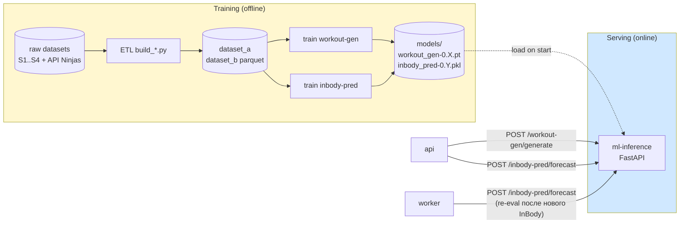
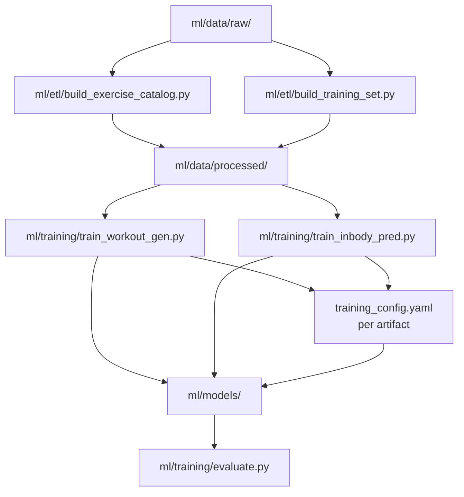

# ML Architecture

Две собственные модели:
- **Workout Generator** (Егор) — рекомендатель упражнений + rule-based composer плана.
- **InBody Predictor** (Маша) — прогноз изменений weight/body_fat/muscle_mass.

Также описан общий serving (`ml-inference`), training pipeline и контракты с `api`/`worker`.

---

## High-level схема



---

## Принципы

1. **Training = offline.** Ретрейн — ручной запуск (Makefile/Justfile target). В runtime ничего не обучается.
2. **Артефакты — версионированные файлы.** `models/workout_gen-0.3.1.pt`, `models/inbody_pred-0.4.2.joblib`. Активная версия пина́ется через env-переменную `WORKOUT_GEN_VERSION` / `INBODY_PRED_VERSION`.
3. **Serving stateless.** ml-inference хранит модели в памяти; всё, что нужно для одного запроса, передаётся в request body. Нет cross-request state.
4. **Контракт стабильный.** Если меняем фичи на входе — мажорная версия модели (`0.x` → `1.0`). API и ml-inference остаются совместимы через версии.
5. **Reproducibility.** Каждое обучение → сохраняется `training_config.yaml` рядом с артефактом: набор фичей, hyperparams, dataset hash, seed.
6. **Privacy.** На обучении используются только анонимизированные данные ([spec 012](../../specs/012-ml-dataset.md)). PII никогда не попадает в training/serving.

---

## ml-inference (serving)

### Эндпоинты

| Метод | Путь | Назначение |
|-------|------|------------|
| `GET`  | `/internal/v1/health` | Liveness |
| `GET`  | `/internal/v1/models` | `{ "workout_gen": "0.3.1", "inbody_pred": "0.4.2" }` |
| `POST` | `/internal/v1/workout-gen/generate` | Сгенерировать план тренировок |
| `POST` | `/internal/v1/inbody-pred/forecast` | Прогноз изменений InBody |
| `POST` | `/internal/v1/inbody-pred/what-if` | Прогноз с override-параметрами |

Авторизация: shared secret в заголовке `X-Internal-Token` (значение из env). nginx не пропускает `/internal/**` снаружи.

### Эндпоинт `workout-gen/generate`

**Request:**
```json
{
  "user_id_hash": "sha256:abcdef...",       // только хэш, не raw user_id
  "features": {
    "sex": "male",
    "age": 28,
    "height_cm": 178,
    "weight_kg": 78.4,
    "body_fat_percent": 18.2,
    "muscle_mass_kg": 35.1,
    "bmr_kcal": 1750,
    "goal": "muscle_gain",
    "training_level": "intermediate",
    "frequency": 4,
    "equipment_available": ["barbell", "dumbbell", "bench", "pullup_bar"]
  },
  "history_features": {
    "avg_tonnage_4w": 12500.0,
    "completed_workouts_4w": 14,
    "best_lifts": { "barbell_bench_press": 65.0, "barbell_squat": 90.0 }
  },
  "exercise_pool": [
    { "exercise_id": "barbell_bench_press", "primary_muscle_group": "chest", "equipment": ["barbell","bench"], "body_region": "upper" },
    ...
  ],
  "seed": 42
}
```

**Response 200:**
```json
{
  "model_version": "workout-gen-0.3.1",
  "weeks": [
    {
      "week_no": 1,
      "days": [
        {
          "day_no": 1,
          "name": "День А — Грудь/Трицепс",
          "type": "strength",
          "exercises": [
            {
              "exercise_id": "barbell_bench_press",
              "order_no": 1,
              "target_sets": 4,
              "target_reps_min": 6,
              "target_reps_max": 8,
              "target_rpe": 8,
              "rest_seconds": 180,
              "target_weight_kg": 60.0,
              "rationale": "primary push, base on best_lift × 0.92"
            }
          ]
        }
      ]
    }
  ],
  "warnings": []
}
```

**Errors:**
- `422` — невалидные фичи.
- `503` — модель не загружена.
- `500` — внутренняя ошибка (api делает fallback).

### Эндпоинт `inbody-pred/forecast`

**Request:**
```json
{
  "user_id_hash": "sha256:...",
  "features": {
    "sex": "male",
    "age": 28,
    "height_cm": 178,
    "goal": "weight_loss"
  },
  "history": [
    { "t_week": -8, "weight_kg": 84.0, "body_fat_percent": 23.0, "muscle_mass_kg": 34.0, "training_volume": 0, "calories": null },
    { "t_week": -4, "weight_kg": 81.5, "body_fat_percent": 21.8, "muscle_mass_kg": 34.2, "training_volume": 11000, "calories": 2300 },
    { "t_week": 0, "weight_kg": 80.0, "body_fat_percent": 20.5, "muscle_mass_kg": 34.5, "training_volume": 12500, "calories": 2300 }
  ],
  "horizons": [1, 2, 4]
}
```

**Response 200:**
```json
{
  "model_version": "inbody-pred-0.4.2",
  "confidence": "high",
  "metrics": {
    "weight_kg": [
      { "horizon_weeks": 1, "point": 79.5, "ci_low": 79.1, "ci_high": 79.9 },
      { "horizon_weeks": 2, "point": 79.0, "ci_low": 78.4, "ci_high": 79.6 },
      { "horizon_weeks": 4, "point": 78.0, "ci_low": 77.0, "ci_high": 79.0 }
    ],
    "body_fat_percent": [...],
    "muscle_mass_kg": [...]
  }
}
```

### Поведение fallback

Если `api` не дождался ответа от `ml-inference` (timeout 12 сек для workout-gen, 5 сек для forecast), он вызывает rule-based fallback (свой код, не ML) и помечает результат `fallback: true`. Пользователь не видит ошибку. Модели Маши/Егора в журнале логов помечаются «не отдали ответ» — это сигнал для расследования.

---

## Workout Generator (Егор)

### Постановка

Дано: фичи пользователя + пул упражнений. Нужно: план на 4 недели = 4 × N тренировочных дней × 4-8 упражнений × подходы/повторения.

### Архитектура (гибридная)


1. **Recommender** — ML-модель ранжирования. Для каждого упражнения из пула выдаёт релевантность фичам пользователя.
   - Кандидаты подходов: GBM (LightGBM/CatBoost) — простой, объяснимый, под малые данные.
   - Альтернатива: small Transformer-encoder для пользовательских фичей с эмбеддингом упражнения. Но для диплома GBM достаточен и проще защитить.
   - **Тренировка:** на `dataset_b_workout_recsys.parquet` ([spec 012](../../specs/012-ml-dataset.md)).
   - **Метрика:** NDCG@10, Recall@10. Цель — превзойти baseline (random + popularity).
2. **Split Composer** — детерминированное правило, как разложить топ-K упражнений на дни:
   - Разбивка по `body_region` так, чтобы одна группа не была два дня подряд.
   - Сплиты по умолчанию: full body / upper-lower / push-pull-legs (в зависимости от частоты).
3. **Progression Engine** — детерминированное правило прогрессии нагрузки на 4 недели:
   - Beginner: Linear progression, +2.5 кг ИЛИ +1 повторение каждую неделю.
   - Intermediate: Double progression — растим повторения внутри диапазона, потом вес.
   - Advanced: периодизация (volume → intensity).

### Граница «что ML, что rule-based»

| Часть | ML или Rule-based | Почему |
|-------|-------------------|--------|
| Выбор и ранжирование упражнений | **ML** | Это персонализация, сложно описать правилом |
| Раскладка по дням | rule-based | Хорошо описывается правилами, лучше предсказуемость |
| Прогрессия | rule-based | Литература по силовому тренингу даёт чёткие схемы |
| Кардио-блок | rule-based | Простая привязка к цели и частоте |
| Целевые веса | rule-based по best_lifts | Иначе нужны очень большие данные |

### Метрики качества (для магистерской Егора)

- NDCG@10, Recall@10 на тестовой выборке.
- Доля сгенерированных планов, проходящих lint-валидатор (баланс групп, нет дубликатов, оборудование совпадает) — цель ≥80%.
- Adoption metric (когда живые пользователи появятся): % завершённых тренировок из запланированных. Цель ≥60%.

### Версионирование

- `workout-gen-0.1.0` — baseline (popularity-based, без ML).
- `workout-gen-0.2.0` — простой LightGBM на профильных фичах.
- `workout-gen-0.3.x` — LightGBM + history features (best lifts).
- `workout-gen-1.0.0` — после первого реального usage feedback.

---

## InBody Predictor (Маша)

### Постановка

Дано: профильные фичи + history (4-8 недель агрегированных тренировок и InBody-замеров). Нужно: прогноз `(weight_kg, body_fat_percent, muscle_mass_kg)` на горизонты `t+1, t+2, t+4` недель + 80%-доверительный интервал.

### Архитектура

```mermaid
flowchart LR
    in[Features + History]
    fe[Feature Engineering<br/>(rolling means, deltas)]
    base[Linear baseline<br/>per-user OLS]
    ml[ML model<br/>quantile GBM × 3 metrics × 3 horizons]
    blend[Confidence-weighted<br/>blend / ensemble]
    out[Forecasts + CI]

    in --> fe --> base
    fe --> ml
    base --> blend
    ml --> blend --> out
```

1. **Feature engineering** — на основе history собираем фичи:
   - rolling mean weight за 2/4/8 недель,
   - delta(weight, t-1, t-4),
   - cumulative training volume,
   - calories deficit/surplus относительно TDEE.
2. **Linear baseline** — простая регрессия по тренду конкретного пользователя. Используется как safety net.
3. **ML модель** — Quantile Gradient Boosting (LightGBM с `objective='quantile'`):
   - Тренируем три квантили: `0.1`, `0.5`, `0.9` → даёт точечную оценку (медиана) и 80%-CI.
   - Один model per metric × horizon (3 × 3 = 9 моделей в одном `joblib` контейнере), либо общая модель с `target_metric` и `horizon` как фичами — выбор зависит от объёма данных.
   - Альтернатива: маленькая LSTM на последовательности недель — даёт более интересную главу для магистерской, но требует больше данных. **Дефолт для MVP** — Quantile GBM, переход на LSTM при наличии данных.
4. **Blend** — comfort weighted blend baseline ↔ ML по `confidence`. На малой истории — больше веса baseline.
5. **Confidence rules:**
   - `high` — ≥4 InBody, ≥6 недель тренировок.
   - `medium` — 2-3 InBody.
   - `low` — 1 InBody (cross-user-only).

### Cross-user baseline (cold start)

Когда у пользователя <4 InBody — модель Маши использует **глобальный** прогноз: «среднестатистический пользователь с такими параметрами и целью теряет/набирает X за t недель». Хранится как табличный prior, обучается на `dataset_b_inbody_timeseries.parquet`.

### Метрики качества (для магистерской Маши)

- MAE по weight (цель ≤1.5 кг на горизонте 4 недели для `high` confidence).
- MAE по body_fat_percent (цель ≤1.5 пп).
- Calibration: фактическое значение должно попадать в 80%-CI ≥75% случаев.
- Превосходство над линейным baseline ≥10% по MAE.

Для отслеживания качества — таблица `forecast_evaluations` (см. [02-data-model.md](02-data-model.md)).

### Версионирование

- `inbody-pred-0.1.0` — линейная регрессия (baseline).
- `inbody-pred-0.2.0` — Quantile GBM, медиана.
- `inbody-pred-0.3.x` — Quantile GBM, три квантили + cross-user prior.
- `inbody-pred-0.4.x` — добавление history features (training_volume, calories).
- `inbody-pred-1.0.0` — переход на LSTM при достаточных данных (фаза 2).

---

## Training pipeline

### Общая схема



### Команды

```bash
# Сборка датасетов
uv run python -m ml.etl.build_exercise_catalog --out ml/data/processed/
uv run python -m ml.etl.build_training_set --out ml/data/processed/

# Обучение
uv run python -m ml.training.train_workout_gen \
  --data ml/data/processed/dataset_b_workout_recsys.parquet \
  --out ml/models/workout_gen-0.3.1 \
  --seed 42

uv run python -m ml.training.train_inbody_pred \
  --data ml/data/processed/dataset_b_inbody_timeseries.parquet \
  --out ml/models/inbody_pred-0.4.2 \
  --seed 42

# Оценка
uv run python -m ml.training.evaluate \
  --model ml/models/workout_gen-0.3.1 \
  --test ml/data/processed/dataset_b_workout_recsys.parquet
```

### Структура артефакта

```
ml/models/workout_gen-0.3.1/
  model.lgb              # бинарь модели
  feature_names.json     # порядок фичей
  enums.json             # mapping enums → integers
  training_config.yaml   # hyperparams, seed, data hash
  metrics.json           # NDCG@10, Recall@10 на test set
```

### Когда переобучаем

- При значимом изменении датасета.
- Каждый семестр (для диплома — раз; в продукте — раз в квартал).
- При выходе модели из границы качества на свежих evaluations (см. forecast_evaluations).

---

## Деплой моделей в ml-inference

1. Команда обучает локально → получает каталог `ml/models/workout_gen-0.4.0/`.
2. Каталог копируется в `deploy/ml-models/` (volume для контейнера ml-inference).
3. В env обновляется `WORKOUT_GEN_VERSION=0.4.0`.
4. `docker compose restart ml-inference`.
5. Health-check (`GET /internal/v1/models`) подтверждает версию.
6. (Опц.) Smoke-test: api делает один тестовый запрос к ml-inference, проверяет ответ.

Откат: меняем env обратно и рестартим.

---

## Контракт совместимости

Когда меняем feature набор:
- **Минор-версия (0.3.1 → 0.3.2)** — изменения, не требующие изменений в `api` (тот же request schema).
- **Мажор (0.3.x → 1.0.0)** — request schema меняется. Тогда `api` должен поддержать обе версии параллельно во время миграции (через `model_version` в request) или иметь deprecation period.

В MVP — только одна активная версия, миграции делаются полным деплоем.

---

## Privacy в ML

- На вход модели подаётся только `user_id_hash` (sha256(user_id + project_salt)), не raw UUID.
- В `input_features` JSON, который сохраняется в БД, PII (имя, email) не попадает.
- Training data анонимизирован на этапе ETL ([spec 012](../../specs/012-ml-dataset.md) REQ-17).
- Если используется LLM в чате (вне основных моделей Маши/Егора), промпт фильтрует PII перед отправкой провайдеру.

---

## Что НЕ делаем в ML (явно)

- Online learning / continual learning.
- A/B-тестирование версий моделей в проде.
- Active learning (запрос разметки от пользователя).
- Распознавание видео / изображений упражнений.
- LLM для генерации плана тренировок (только rule-based + GBM).
- Federated learning, differential privacy — out of scope для диплома.
