# Key Flows — Sequence Diagrams

Диаграммы взаимодействий для ключевых сценариев. Все диаграммы используют:
- `client` — Flutter PWA
- `api` — FastAPI монолит
- `worker` — Celery worker
- `ml` — ml-inference сервис
- `pg` — PostgreSQL
- `redis` — Redis
- `minio` — MinIO
- `sg` — SendGrid

---

## 1. Регистрация и подтверждение email (spec 001)

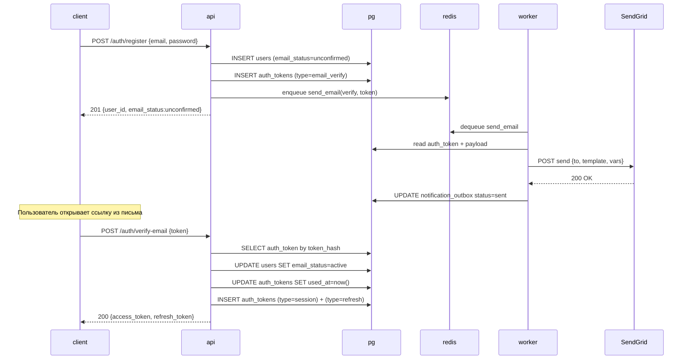

---

## 2. Логин с rate limiting (spec 001)

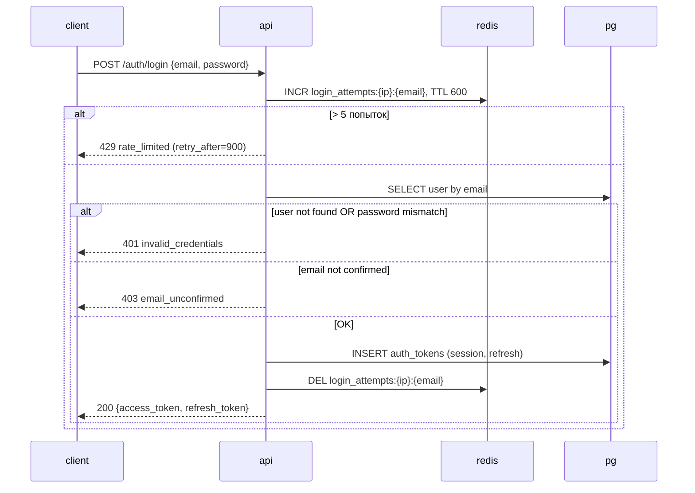

---

## 3. Загрузка PDF InBody (spec 003, 013)

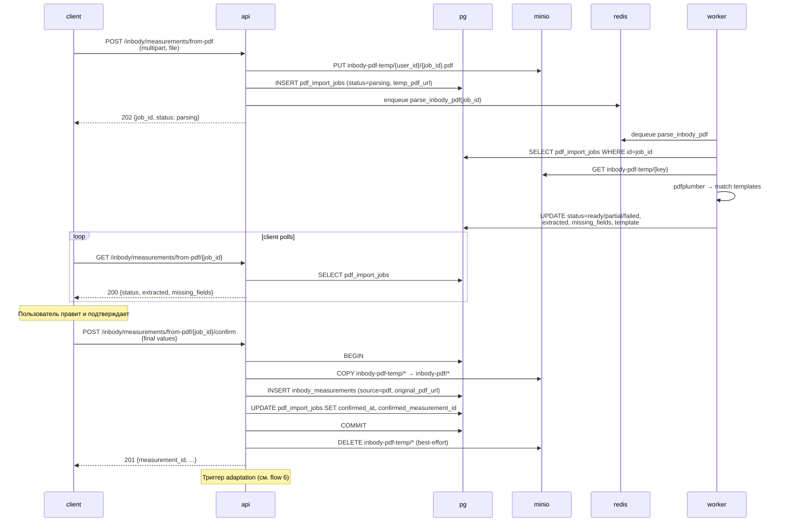

---

## 4. Генерация плана тренировок (spec 006)

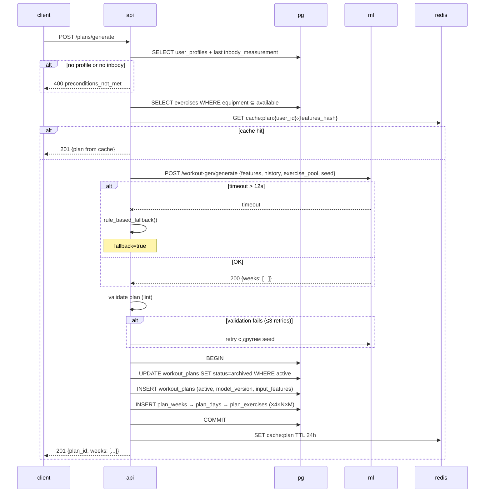

---

## 5. Прогноз InBody (spec 008)

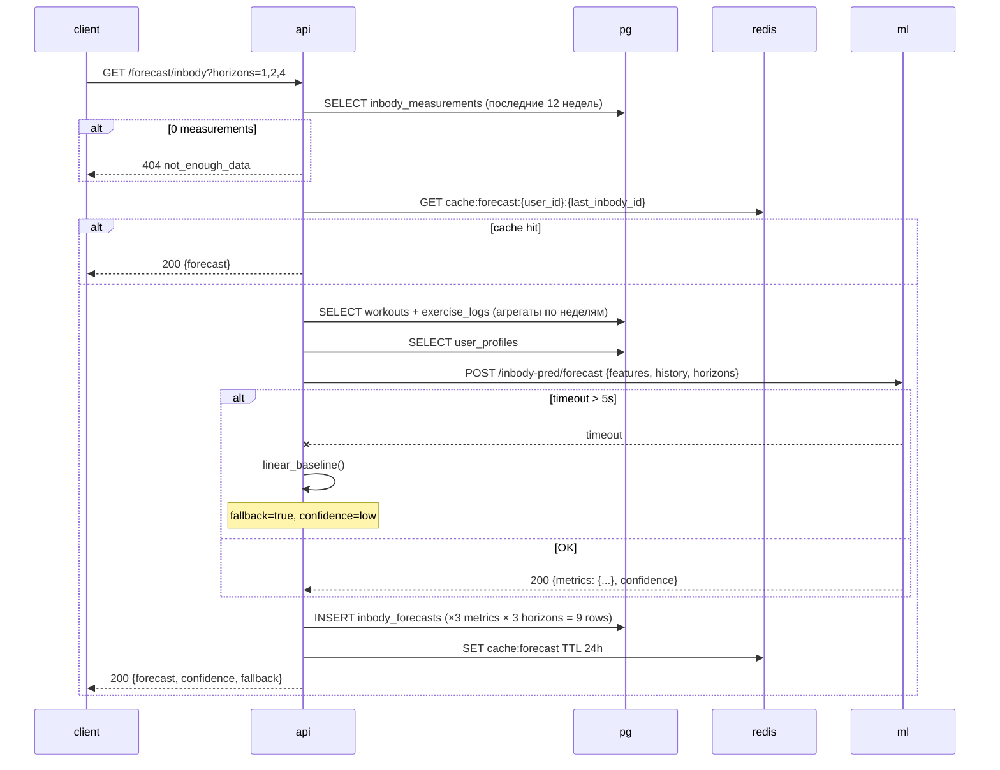

---

## 6. Адаптация плана при новом InBody (spec 009)

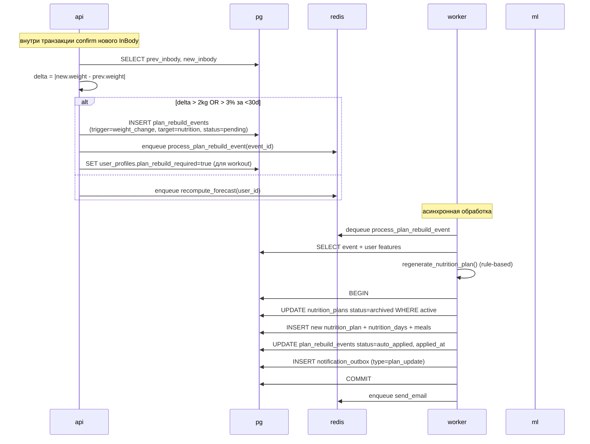

---

## 7. Cron-триггеры (Celery Beat) (spec 011)

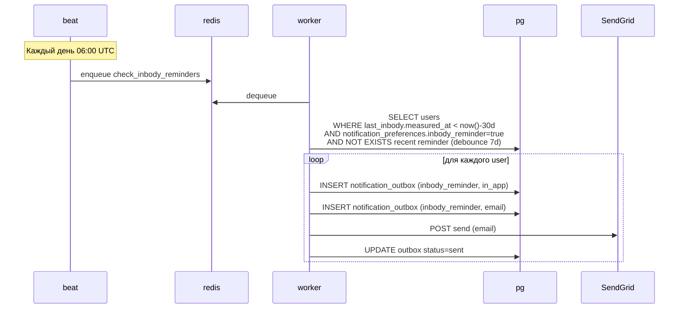

---

## 8. Старт и завершение тренировки (spec 005)

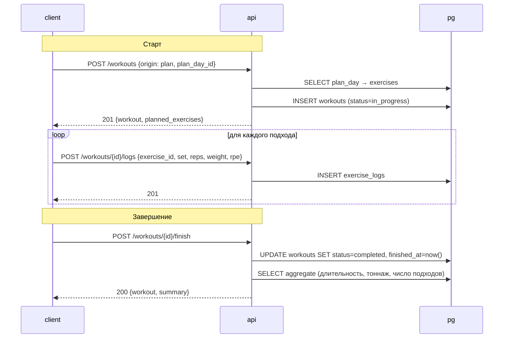

### Авто-завершение (через 12ч простоя)

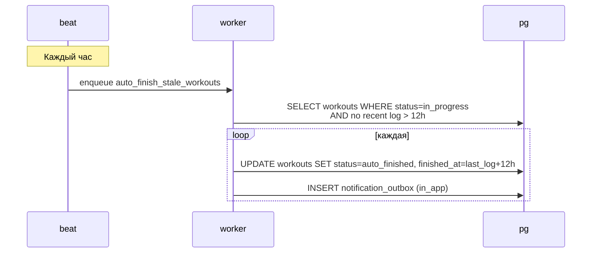

---

## 9. Чат-ассистент: scripted vs LLM (spec 009)

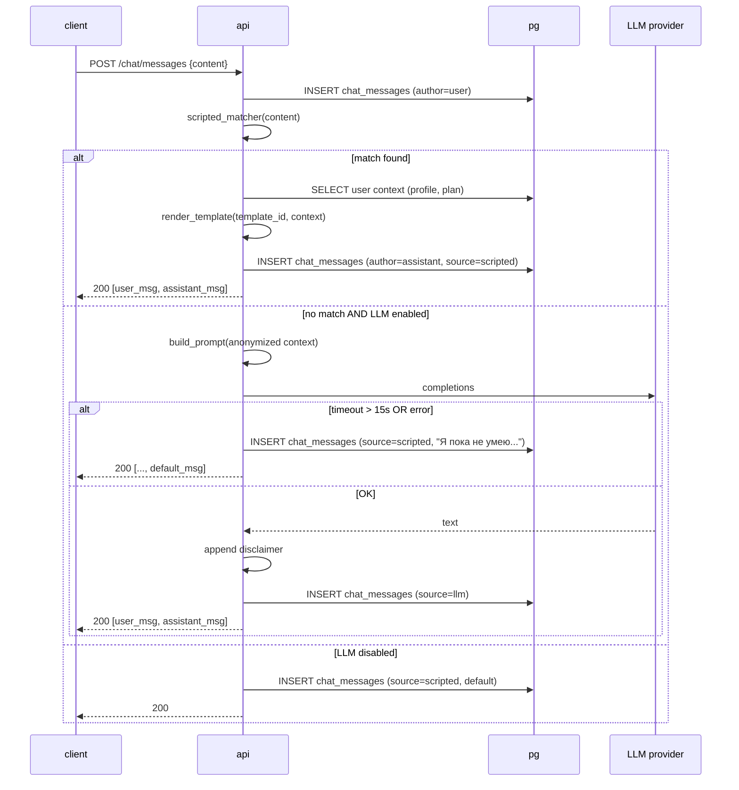

---

## 10. Экспорт PDF-отчёта (spec 010)

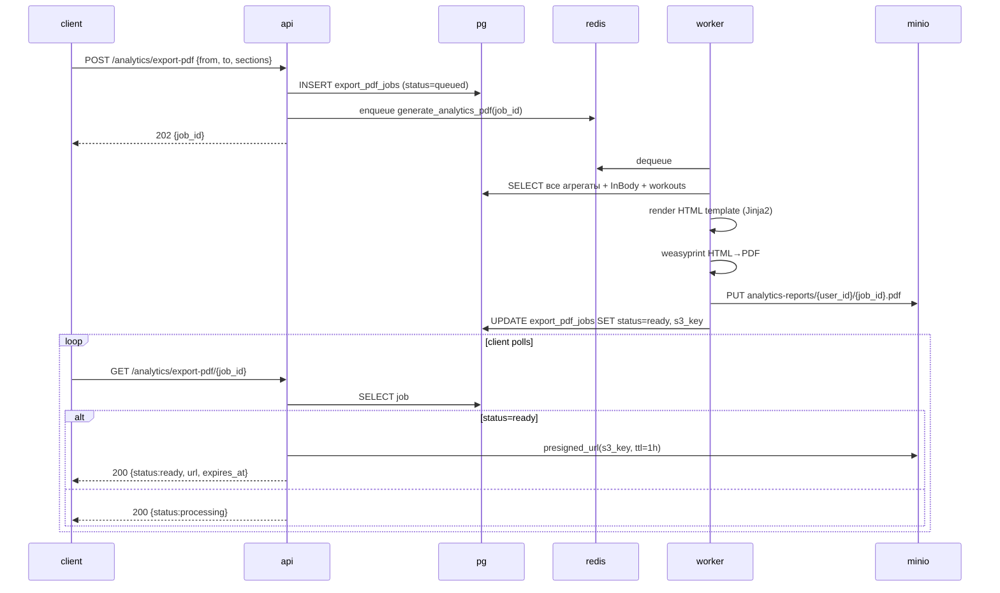

---

## 11. GDPR-удаление аккаунта (spec 002)

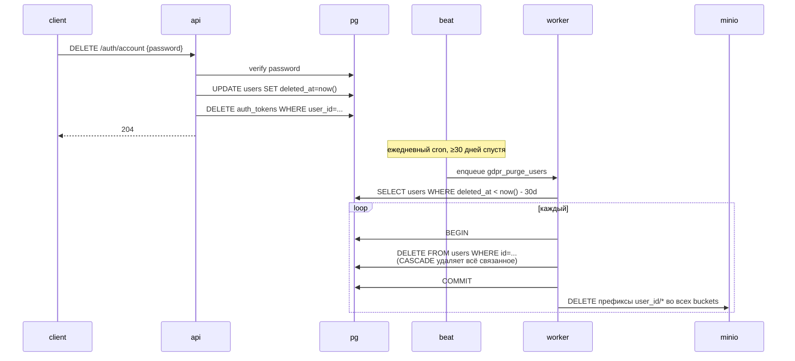

---

## 12. Высокоуровневая страница «Сегодня» (spec 005, 006, 007)

Это не отдельный flow, а композиция нескольких read-only запросов, которые клиент делает в параллель при открытии главного экрана:

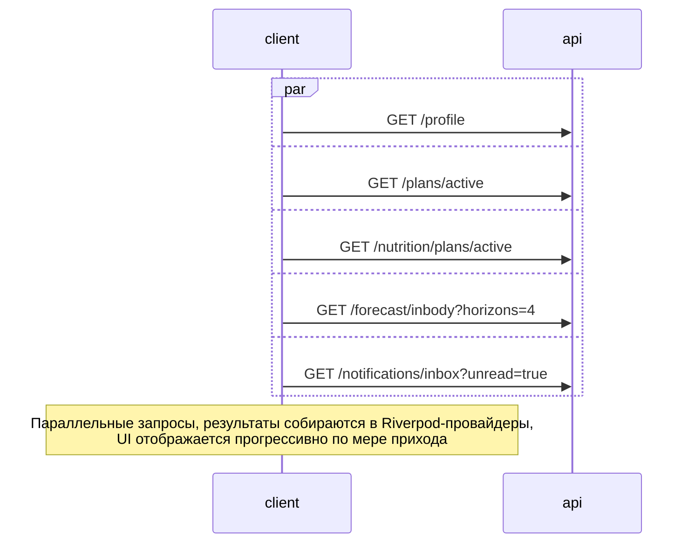
