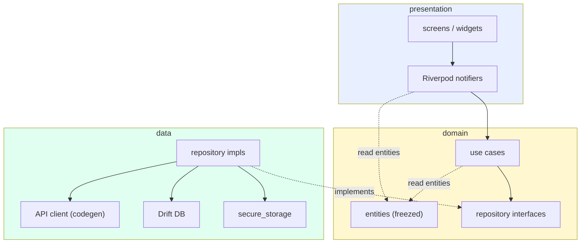
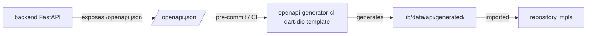
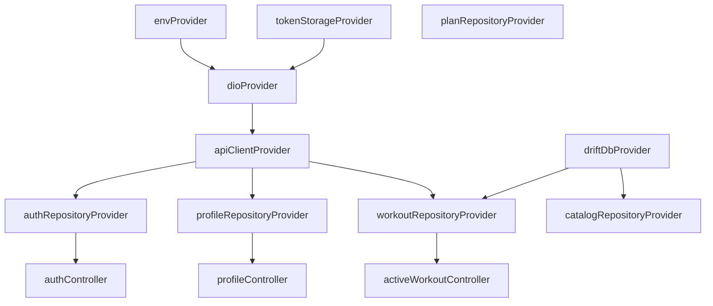
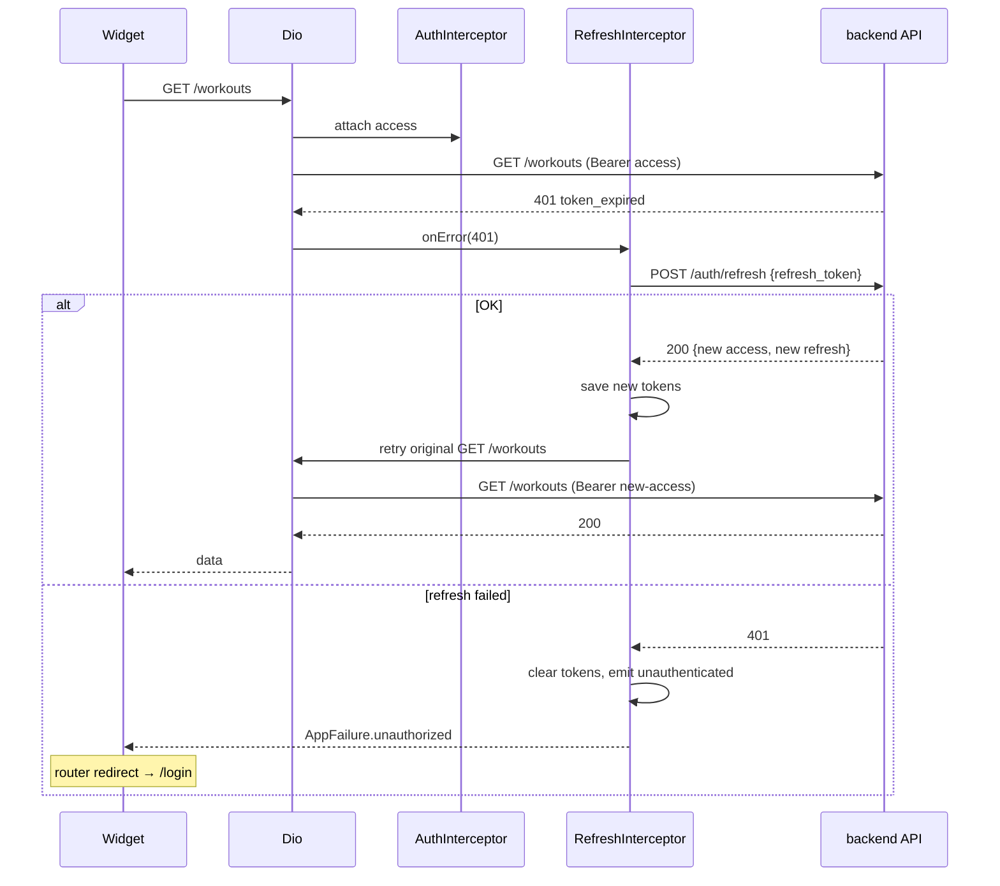

# Frontend Architecture (Flutter PWA)

Подробное описание клиентской части. Подразумевается, что бэкенд и API-контракты описаны в [01-system-components.md](01-system-components.md), [04-flows.md](04-flows.md), [06-api-design.md](06-api-design.md).

---

## Стек

| Что | Зачем |
|-----|-------|
| Flutter 3.x stable | UI-фреймворк, web target |
| Dart 3.x | язык |
| Riverpod 2.x | state management + DI |
| Dio + http_mock_adapter | HTTP клиент + моки в тестах |
| go_router 14+ | декларативный роутинг с deep links |
| openapi-generator-cli | кодоген клиента из `/openapi.json` |
| freezed + json_serializable | где модели не из codegen (UI state, view-models) |
| drift (SQLite via WASM на web) | локальная БД для офлайн-кэша и outbox |
| flutter_secure_storage | хранение refresh-токена (web → IndexedDB через secure-storage shim) |
| fl_chart | графики аналитики |
| intl + flutter_localizations + ARB | i18n |
| logger | структурированные логи в консоль |

shadcn-Flutter — это **дизайн-вдохновение**, не рантайм-зависимость; фактически берём Material 3 и кастомизируем тему под shadcn-эстетику (см. раздел Theming).

---

## Принципы

1. **Layered architecture (presentation / domain / data)** с однонаправленными зависимостями: presentation → domain → data. Никаких импортов в обратную сторону.
2. **Feature-first** структура каталогов внутри слоя presentation: каждая фича — свой каталог с экранами, виджетами, провайдерами.
3. **Offline-first для критичных потоков** (активная тренировка, последний план, кэш каталога). Остальное — online с retry.
4. **Codegen-first для API:** Dart-клиент генерируется из OpenAPI; ручные DTO — только для офлайн-моделей в Drift.
5. **State через Riverpod, без BuildContext API**: провайдеры читаются через `ref` в виджете, side-effects в notifier'ах.
6. **No business logic в виджетах**: виджет читает state и шлёт интенты в notifier; notifier зовёт use case (или прямо репозиторий, если кейс тривиален).
7. **i18n с первого дня**: все user-facing строки — через ARB-ключи, без hardcoded.

---

## High-level картинка



Зависимости: `presentation → domain → data`. Между слоями — общие модели (`entities`).

---

## Структура репозитория

```
pwa/
  pubspec.yaml
  build.yaml                       # build_runner
  analysis_options.yaml            # ruff-эквивалент: very_good_analysis
  lib/
    main.dart
    bootstrap.dart                 # ProviderScope + перехват errors

    app/
      app.dart                     # MaterialApp.router
      router.dart                  # go_router routes + auth guard
      theme/
        app_theme.dart             # M3 ColorScheme + shadcn-стиль
        text_styles.dart
        spacing.dart
      l10n/                        # ARB + сгенерированный AppLocalizations
        app_ru.arb
        app_en.arb                 # пусто/заглушки на старте; для будущего

    core/
      env/
        env.dart                   # const API_BASE_URL и т.д. (build-time)
      errors/
        app_failure.dart           # freezed sealed: NetworkFailure, ApiFailure(code,message), ...
      result.dart                  # typedef Result<T> = Future<Either<AppFailure, T>>
      logger.dart
      analytics.dart               # noop в MVP

    data/
      api/                         # ↓ ВЕСЬ КОДОГЕН ↓
        generated/                 # из openapi-generator (gitignored, регенерится)
        api_module.dart            # Riverpod провайдер для сгенерированного клиента
        dio_factory.dart           # Dio + interceptors (auth, logging, error mapping)
      local/
        db/                        # Drift database
          database.dart
          tables/
            workout_drafts.dart
            outbox.dart
            exercise_cache.dart
        secure/
          token_storage.dart
      repositories/                # имплементации портов из domain/
        auth_repository_impl.dart
        profile_repository_impl.dart
        workout_repository_impl.dart
        ...
      sync/
        outbox_processor.dart      # retry-mechanism для отложенных POST'ов

    domain/
      entities/                    # freezed модели, отвязанные от API
        user_profile.dart
        inbody_measurement.dart
        workout.dart
        exercise.dart
        workout_plan.dart
        ...
      ports/                       # абстракции репозиториев
        auth_repository.dart
        profile_repository.dart
        ...
      usecases/                    # в одном каталоге — много мелких файлов
        login.dart
        log_workout_set.dart
        finish_workout.dart
        generate_workout_plan.dart
        ...

    features/
      auth/
        screens/
          login_screen.dart
          register_screen.dart
          verify_email_screen.dart
        widgets/
        providers/
          auth_controller.dart    # AsyncNotifier
      onboarding/
      profile/
      inbody/
      catalog/
      workouts/
        screens/
          active_workout_screen.dart
          workout_history_screen.dart
        widgets/
          set_input.dart
          rest_timer.dart
        providers/
          active_workout_controller.dart
      plan/
      nutrition/
      forecast/
      chat/
      analytics/
      notifications/

    ui/                            # shared UI building blocks
      buttons/
      forms/
      charts/                      # обёртки над fl_chart с темой
      empty_states/
      loaders/

  test/
    unit/                          # use cases, notifiers
    widget/                        # отдельные экраны
    integration/                   # full flows через mock adapter
```

---

## Слои

### Presentation

**Что:** экраны, виджеты, провайдеры (Riverpod notifiers).

**Правила:**
- Виджет читает `ref.watch(someProvider)`; side-effect через `ref.read(someProvider.notifier).method()`.
- Виджет НЕ импортирует ничего из `data/`. Только `domain/entities` и провайдеры из своей фичи.
- Один экран = один тонкий `*_screen.dart` + крупные виджеты, разнесённые в `widgets/`.
- Логика загрузки/синхронизации — в notifier'ах, не в `initState` виджетов.

**Notifier conventions:**

```dart
// features/workouts/providers/active_workout_controller.dart
@riverpod
class ActiveWorkoutController extends _$ActiveWorkoutController {
  @override
  Future<ActiveWorkoutState> build() async {
    final repo = ref.read(workoutRepositoryProvider);
    return repo.loadActive();
  }

  Future<void> logSet(LogSetParams params) async {
    final repo = ref.read(workoutRepositoryProvider);
    final usecase = LogWorkoutSet(repo);
    state = const AsyncLoading();
    state = await AsyncValue.guard(() => usecase(params));
  }
}
```

Используем `AsyncNotifier` / `Notifier` из `riverpod_generator` — typed, c кодогеном.

### Domain

**Что:** entity-модели и use cases — чистая Dart-логика без зависимостей на Flutter.

**Правила:**
- Никаких `import 'package:flutter/...'` в `domain/`.
- Entity — `freezed`-модели с явной валидацией в фабриках.
- Use case — это callable-класс: `class LogWorkoutSet { Future<Result<...>> call(params); }`. Один use case = один файл.
- Use cases зависят от *port'ов* (абстрактных репозиториев), а не от их реализаций.

### Data

**Что:** репозитории (имплементации портов), API client, локальная БД, secure storage.

**Правила:**
- Репозиторий маппит API DTO ↔ domain entity (никогда не отдаёт в presentation сырой API-объект).
- Сетевые ошибки и Drift-ошибки оборачиваются в `AppFailure` (см. error handling).
- Outbox-процессор живёт здесь; запускается из `app/bootstrap.dart` при старте.

---

## Codegen из OpenAPI

### Pipeline



### Команды

```bash
# Скачать актуальный openapi.json от backend
curl -s http://localhost:8000/openapi.json > tools/openapi.json

# Генерация
openapi-generator-cli generate \
  -i tools/openapi.json \
  -g dart-dio \
  -o lib/data/api/generated \
  --additional-properties=pubName=fitness_api,pubAuthor=team

# Format
dart format lib/data/api/generated
```

Это завязано на `make codegen` или Justfile target. Каталог `generated/` — gitignored, регенерируется в CI.

### Что не из codegen

- UI state (notifiers) — пишем руками + freezed.
- Локальные DB-модели Drift — отдельные.
- Domain entities — отдельные, чтобы не тянуть API-форму в бизнес-логику.

### Маппинг

В каждом репозитории — приватный маппер:

```dart
extension on InbodyMeasurementDto {
  InbodyMeasurement toDomain() => InbodyMeasurement(
    id: id,
    measuredAt: measuredAt,
    weightKg: weightKg,
    bodyFatPercent: bodyFatPercent,
    // ...
  );
}
```

---

## Routing (go_router)

### Структура

```mermaid
flowchart TB
    root[/]
    auth[/login, /register, /verify-email, /forgot-password]
    onboarding[/onboarding/profile-step-N]
    home[/home]

    home --> tabs[bottom tabs]
    tabs --> dash[/home/dashboard]
    tabs --> workouts[/home/workouts]
    tabs --> plan[/home/plan]
    tabs --> analytics[/home/analytics]
    tabs --> chat[/home/chat]

    workouts --> active[/home/workouts/active/{id}]
    workouts --> history[/home/workouts/history]

    plan --> day[/home/plan/{week}/{day}]

    analytics --> body[/home/analytics/body]
    analytics --> goal[/home/analytics/goal]
    analytics --> compare[/home/analytics/compare]

    inbody[/inbody]
    inbody_add[/inbody/add]
    inbody_pdf[/inbody/upload-pdf/{job_id}]

    settings[/settings]
    settings_profile[/settings/profile]
    settings_notifications[/settings/notifications]
```

### Auth guard

`go_router` redirect:
1. Если `authState == unauthenticated` и target требует auth → `/login`.
2. Если `authState == unconfirmed` → `/verify-email`.
3. Если `onboardingCompletedAt == null` → `/onboarding/...` (запрет переходить на `/home/*`).
4. Иначе — пропускаем.

`authState` — провайдер, читается guard'ом без перерисовки навигации (`refreshListenable: ChangeNotifier-обёртка`).

### Deep links

PWA URL-based: `https://fitness.local/home/workouts/active/9f8e...` — открывает активную тренировку. Полезно для:
- Push-уведомлений (in-app inbox клик → переход на нужный экран).
- Восстановления после потери связи (URL в адресной строке).

---

## State management — Riverpod

### Иерархия провайдеров



### Виды провайдеров

| Тип | Использование |
|-----|---------------|
| `Provider` | Читают env, конфиг — синхронно неизменное |
| `Provider.family` | Конфигурируемые синглтоны (например, repo с базовым URL) |
| `FutureProvider` | One-shot загрузка (профиль, активный план) |
| `StreamProvider` | Поток из Drift (история тренировок) |
| `AsyncNotifier` | Сложный async state с действиями (active workout) |
| `Notifier` | Sync state (формы регистрации) |

Все провайдеры объявляются через `@riverpod` (riverpod_generator) — typed, без боилерплейта.

### `keepAlive`

По умолчанию провайдеры утилизируются при отсутствии слушателей. Длинные кэши (профиль, каталог) объявляются с `@Riverpod(keepAlive: true)`.

---

## HTTP layer

### Dio interceptors

Порядок:
1. **Auth interceptor** — добавляет `Authorization: Bearer <access>`.
2. **Refresh interceptor** — на 401 пытается refresh, повторяет оригинальный запрос.
3. **Error mapping interceptor** — превращает `DioException` в `AppFailure`.
4. **Logging interceptor** — только в debug-режиме.
5. **Request id interceptor** — добавляет `X-Request-ID` (uuid v4 на запрос).

### Refresh-flow на клиенте



Защита от concurrent refresh: одна `Future` хранится в interceptor; параллельные 401 ждут её.

### Mock-адаптер для тестов

```dart
final dio = Dio();
final adapter = DioAdapter(dio: dio);
adapter.onPost('/api/v1/auth/login', (server) =>
  server.reply(200, {'access_token': '...', 'refresh_token': '...'}),
);
```

Используется в integration-тестах фич.

---

## Error handling

### Иерархия ошибок

```dart
@freezed
sealed class AppFailure with _$AppFailure {
  const factory AppFailure.network() = NetworkFailure;
  const factory AppFailure.timeout() = TimeoutFailure;
  const factory AppFailure.unauthorized() = UnauthorizedFailure;
  const factory AppFailure.api({
    required String code,        // 'weak_password', 'email_taken', ...
    required String message,
    Map<String, dynamic>? details,
  }) = ApiFailure;
  const factory AppFailure.unexpected(Object error, StackTrace stack) = UnexpectedFailure;
}
```

### Маппинг

- В `AuthRefreshInterceptor` → `UnauthorizedFailure`.
- На `DioExceptionType.connectionError` → `NetworkFailure`.
- На `DioExceptionType.receiveTimeout` → `TimeoutFailure`.
- На `4xx`/`5xx` с JSON-ошибкой → `ApiFailure(code, message)`.

### Отображение

`features/<x>/widgets/failure_view.dart` — единый компонент:

```
match failure:
  network → "Нет сети, проверьте подключение"
  timeout → "Долго ждали ответа..."
  api(code='weak_password') → l10n.errPasswordTooWeak
  api(code='email_taken') → l10n.errEmailTaken
  unauthorized → triggers router.go('/login')
  unexpected → "Что-то пошло не так. Попробуйте ещё раз"
```

Все error-strings — через ARB, не hardcoded.

---

## Offline persistence (Drift)

### Зачем Drift

Spec 005 требует:
- NFR-02 — тренировка пишется офлайн с синхронизацией позже.
- NFR-03 — прогресс не теряется при kill приложения.

Это нельзя сделать на in-memory state. Нужен persistent store + outbox-pattern.

Drift работает на web через WASM (sql.js / wa-sqlite). На mobile — нативный SQLite.

### Schema

```dart
@DataClassName('WorkoutDraftRow')
class WorkoutDrafts extends Table {
  TextColumn get id => text()();          // local UUID
  TextColumn get serverId => text().nullable()();  // null до первого sync
  TextColumn get planDayId => text().nullable()();
  TextColumn get origin => text()();      // 'plan' | 'freestyle'
  DateTimeColumn get performedAt => dateTime()();
  DateTimeColumn get finishedAt => dateTime().nullable()();
  TextColumn get status => text()();      // 'in_progress' | 'completed' | ...
  @override
  Set<Column> get primaryKey => {id};
}

@DataClassName('ExerciseLogRow')
class ExerciseLogs extends Table {
  TextColumn get id => text()();
  TextColumn get workoutId => text().references(WorkoutDrafts, #id, onDelete: KeyAction.cascade)();
  TextColumn get exerciseId => text()();
  IntColumn get setNumber => integer()();
  IntColumn get reps => integer()();
  RealColumn get weightKg => real()();
  IntColumn get rpe => integer().nullable()();
  IntColumn get restSeconds => integer().nullable()();
  BoolColumn get skipped => boolean().withDefault(const Constant(false))();
  DateTimeColumn get loggedAt => dateTime()();
  @override
  Set<Column> get primaryKey => {id};
}

@DataClassName('OutboxItem')
class Outbox extends Table {
  TextColumn get id => text()();
  TextColumn get kind => text()();        // 'log_set' | 'finish_workout' | ...
  TextColumn get payload => text()();     // JSON
  IntColumn get attempts => integer().withDefault(const Constant(0))();
  DateTimeColumn get nextAttemptAt => dateTime()();
  TextColumn get lastError => text().nullable()();
  @override
  Set<Column> get primaryKey => {id};
}

@DataClassName('ExerciseCacheRow')
class ExerciseCache extends Table {
  TextColumn get id => text()();
  TextColumn get json => text()();
  DateTimeColumn get cachedAt => dateTime()();
  @override
  Set<Column> get primaryKey => {id};
}
```

### Outbox pattern

```mermaid
sequenceDiagram
    participant U as UI
    participant Repo as WorkoutRepository
    participant Drift as Drift
    participant Out as OutboxProcessor
    participant Api as backend

    U->>Repo: logSet(params)
    Repo->>Drift: INSERT exercise_logs (local id)
    Repo->>Drift: INSERT outbox kind=log_set, payload
    Repo-->>U: ok (UI-реактивно через stream)

    Note over Out: фоновый, на каждый успешный online-pulse
    Out->>Drift: SELECT outbox WHERE next_attempt_at ≤ now ORDER BY id
    Out->>Api: POST /workouts/{server_id}/logs payload
    alt OK
        Api-->>Out: 201
        Out->>Drift: DELETE outbox row
    else 4xx (валидация, не починим)
        Out->>Drift: mark as poison; UI получает уведомление
    else 5xx / network
        Out->>Drift: UPDATE attempts++, next_attempt_at = exp backoff
    end
```

Активная тренировка читается из Drift через `StreamProvider`, UI обновляется реактивно. Outbox-процессор слушает change в connectivity (через `connectivity_plus`) и таймер раз в 30 сек.

### Кэш каталога упражнений

При первом запуске — загружаем полный каталог (≥500 упражнений), пишем в `ExerciseCache`. TTL 7 дней; при онлайне в фоне обновляем.

### Что НЕ кладём в Drift

- Профиль пользователя — read-only кэш в Riverpod, источник правды — backend.
- InBody-замеры — то же.
- Активный план тренировок — кэшируем только метаданные (id, valid_until); подробный план хранится server-side.
- История чата — пагинируется с сервера, не оффлайн-доступна.

---

## Auth & Token storage

| Что | Где |
|-----|-----|
| `access_token` | в памяти Riverpod-провайдера (`Provider<AuthSession>`) |
| `refresh_token` | `flutter_secure_storage` |
| `user_id` (для последующих запросов) | в памяти |

При старте приложения (`bootstrap.dart`):
1. Читаем `refresh_token` из secure storage.
2. Если есть — пробуем `POST /auth/refresh`. На успех — записываем access в state, `authState = authenticated`.
3. На неудачу — clear refresh, `authState = unauthenticated`.

Logout = удалить токены + `authState = unauthenticated`.

### Web-специфика

`flutter_secure_storage` на web использует IndexedDB с шифрованием через WebCrypto. Не идеально (XSS может всё равно достать), поэтому:
- Жёсткий CSP (см. [07-security.md](07-security.md)).
- TTL refresh-токена 30 дней — компромисс.

---

## Theming

### Material 3 + shadcn-стиль

Берём Material 3 как баzu, кастомизируем под shadcn-эстетику:
- Нейтральная палитра (slate / zinc).
- Скруглённые углы 8–12 px (`shapeRadius`).
- Минималистичные тени (elevation 0–2).
- Плотная типографика (Inter или системный sans-serif).

```dart
ThemeData buildLightTheme() => ThemeData(
  useMaterial3: true,
  colorScheme: ColorScheme.fromSeed(
    seedColor: const Color(0xFF0F172A), // slate-900
    brightness: Brightness.light,
  ),
  textTheme: AppTextStyles.textTheme(brightness: Brightness.light),
  cardTheme: const CardTheme(
    elevation: 0,
    shape: RoundedRectangleBorder(
      borderRadius: BorderRadius.all(Radius.circular(12)),
      side: BorderSide(color: AppColors.border),
    ),
  ),
  // ...
);
```

### Light + Dark + system

Тема по умолчанию следует системе (`ThemeMode.system`). Пользователь может переопределить в настройках; выбор сохраняется в `shared_preferences`.

### Responsive

- `LayoutBuilder` + breakpoints `mobile (<600)`, `tablet (600..1024)`, `desktop (>=1024)`.
- На mobile — bottom navigation.
- На tablet/desktop — left rail или left drawer + двух- / трёх-колоночные scaffold-ы для аналитики и плана.
- Графики (`fl_chart`) масштабируются под ширину контейнера.

### Типография

| Стиль | Где |
|-------|-----|
| `displayLarge` (32 / 700) | Заголовки экранов аналитики |
| `headlineMedium` (24 / 600) | Карточки saммари |
| `titleLarge` (18 / 600) | Заголовки секций |
| `bodyMedium` (14 / 400) | Основной текст |
| `labelMedium` (12 / 500) | Чипы, подписи |

---

## Локализация (RU)

### Структура

```
lib/app/l10n/
  app_ru.arb
  app_en.arb        # пустой/заглушка, для будущего
```

`flutter_localizations` + `intl` + ключи через `AppLocalizations.of(context)`.

### Правила

- **Ноль hardcoded строк** в widget-коде. Везде `l10n.someKey`.
- ARB-ключи — `camelCase`, осмысленные (`errPasswordTooWeak`, не `error1`).
- Плейсхолдеры с типами и форматтерами:

```json
{
  "weeklySummaryGreeting": "{userName}, на этой неделе вы провели {count} тренировок",
  "@weeklySummaryGreeting": {
    "placeholders": {
      "userName": { "type": "String" },
      "count": { "type": "int", "format": "compact" }
    }
  }
}
```

### Числа и даты

- Веса/объёмы — `NumberFormat.decimalPattern('ru')` с одним знаком после запятой.
- Даты — `DateFormat.yMMMd('ru')` для read-only display, `DateFormat.yMd('ru')` в формах.
- Все даты на UI — в локальной TZ пользователя (сервер шлёт UTC, конвертим на клиенте).

---

## PWA-специфика

### Service Worker

Flutter Web автоматически генерирует `flutter_service_worker.js`. Дополнительно:
- Cache-стратегия: `CacheFirst` для статики, `NetworkFirst` для API (но мы не кэшируем API через SW — это делает Drift).
- Update flow: при выходе новой версии SW — баннер «Доступно обновление» с кнопкой «Перезагрузить».

### Install prompt

Слушаем событие `beforeinstallprompt`, показываем баннер «Установить как приложение» после 2-х сессий пользователя.

### Manifest

```json
{
  "name": "Fitness Tracker",
  "short_name": "FitTracker",
  "start_url": "/?source=pwa",
  "display": "standalone",
  "orientation": "portrait",
  "background_color": "#0F172A",
  "theme_color": "#0F172A",
  "icons": [
    { "src": "icons/192.png", "sizes": "192x192", "type": "image/png" },
    { "src": "icons/512.png", "sizes": "512x512", "type": "image/png" }
  ]
}
```

### Push (out of scope)

Web Push в MVP не реализуем (см. [spec 011](../../specs/011-notifications.md) Out of Scope). In-app inbox + email — основные каналы.

---

## Работа с графиками (fl_chart)

- Обёртка `ui/charts/` принимает domain-данные (List<DataPoint>), не raw DTO.
- Темизация: цвета — из `Theme.of(context).colorScheme`, не hardcoded.
- Forecast band (для [spec 008](../../specs/008-ai-inbody-predictor.md)) — кастомная отрисовка через `LineChartBarData` с тремя сериями (точечная + lower + upper) и заливкой между ними.
- Lazy: график рендерится только когда видим (через `VisibilityDetector`).

---

## Тестирование

### Уровни

| Уровень | Инструмент | Что покрываем | Где |
|---------|------------|---------------|-----|
| Unit | `package:test` | use cases, репозитории, мапперы, валидация форм | `test/unit/` |
| Widget | `flutter_test` | отдельные виджеты и экраны (с фейковыми провайдерами) | `test/widget/` |
| Integration | `flutter_test` + `http_mock_adapter` | full flow: register → login → create workout | `test/integration/` |
| E2E (опц.) | `integration_test` package + `chromedriver` | пара критичных сценариев на реальном Flutter Web | `test/e2e/` |

### Conventions

- Каждый use case покрыт ≥1 happy-path + ≥1 error-path.
- Виджеты со state — обязательно тест на состояния loading/error/empty/success.
- Моки — через `mocktail` (mockito не нужен).
- Riverpod-тесты используют `ProviderContainer` с `overrides`.

```dart
testWidgets('login submits credentials', (tester) async {
  final container = ProviderContainer(
    overrides: [
      authRepositoryProvider.overrideWithValue(FakeAuthRepository()),
    ],
  );
  await tester.pumpWidget(
    UncontrolledProviderScope(container: container, child: const LoginScreen()),
  );
  // ...
});
```

### CI

- `flutter analyze` — обязательно.
- `flutter test --coverage` — purpose-coverage ≥70% (без `data/api/generated/`).
- `flutter build web --release` — должен проходить.
- Регенерация client (если изменился openapi.json) — отдельный job; на расхождение — fail PR с подсказкой `make codegen`.

---

## Performance

### Bundle

- Lazy routes (deferred imports) для тяжёлых фич: чат-ассистент, аналитика, экспорт PDF — `import deferred as`.
- Tree-shake fonts: используем системные через `Theme.of(context).textTheme` или один шрифт Inter (.ttf + subset).
- Avoid большие images в bundle — иконки SVG через `flutter_svg`.

### Runtime

- Каталог упражнений — пагинация, не загружаем все 500 сразу.
- Графики — `VisibilityDetector` + `RepaintBoundary`.
- Списки — `ListView.builder`, не Column.
- Активная тренировка — обновления через Drift stream (точечные изменения), не пересборка всего экрана.

---

## Соответствие спекам

| Spec | Где реализуется на клиенте |
|------|----------------------------|
| 001 — Auth | `features/auth/`, `data/secure/`, refresh interceptor |
| 002 — Profile | `features/profile/`, `features/onboarding/` |
| 003 — InBody | `features/inbody/` |
| 004 — Catalog | `features/catalog/` + Drift `ExerciseCache` |
| 005 — Workouts | `features/workouts/` + Drift WorkoutDrafts/ExerciseLogs/Outbox |
| 006 — Plan generator | `features/plan/`, отображение результата от `ml-inference` |
| 007 — Nutrition | `features/nutrition/` |
| 008 — Forecast | `features/forecast/` + chart-обёртка с CI band |
| 009 — Adaptation & Chat | `features/chat/`, баннер на dashboard для plan_rebuild |
| 010 — Analytics | `features/analytics/` + `ui/charts/` |
| 011 — Notifications | `features/notifications/` (inbox + settings) |

---

## Что НЕ делаем (явно)

- Native iOS/Android приложения. Только PWA. Нативные shells (Capacitor / TWA) — out of scope.
- Web Push — фаза 2.
- Голосовой ввод в чате — out of scope.
- Background sync через service worker — фаза 2 (в MVP outbox-процессор работает только пока приложение открыто).
- Real-time чат через WebSocket — request/response в MVP.
- Анимации/motion-design сверх базового Material — без отдельного дизайн-направления.

---

## Открытые вопросы

| # | Вопрос | Дефолт |
|---|--------|--------|
| 1 | Дизайн-макеты есть в Figma? | Если есть — даём дизайнеру/команде; если нет — берём референсы из shadcn examples |
| 2 | Шрифт — Inter или системный? | Inter (читаемость, кириллица) |
| 3 | Поддержка iPad / больших экранов в MVP? | Responsive есть, но full desktop layout — фаза 2 |
| 4 | Темная тема в MVP — обязательная? | Делаем сразу (M3 light/dark из одной seedColor — почти бесплатно) |

---

## Iteration 0 (frontend skeleton)

Список того, что нужно поднять перед началом фич:

- [ ] `pubspec.yaml` со всеми зависимостями + `build_runner` configs
- [ ] `analysis_options.yaml` с `very_good_analysis`
- [ ] go_router scaffold с auth guard и пустыми экранами
- [ ] Riverpod scope в `bootstrap.dart`
- [ ] Dio + interceptors (auth заглушка)
- [ ] Drift database с пустыми таблицами + миграция
- [ ] Theme (light + dark)
- [ ] ARB + AppLocalizations (`l10n.welcomeTitle` etc.)
- [ ] Заглушка openapi-generator (даже если backend ещё не готов — генерим из локального swagger.json-stub)
- [ ] `flutter test` зелёный на одном smoke-тесте
- [ ] CI пайплайн: analyze + test + build web
